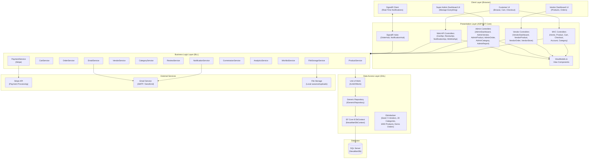
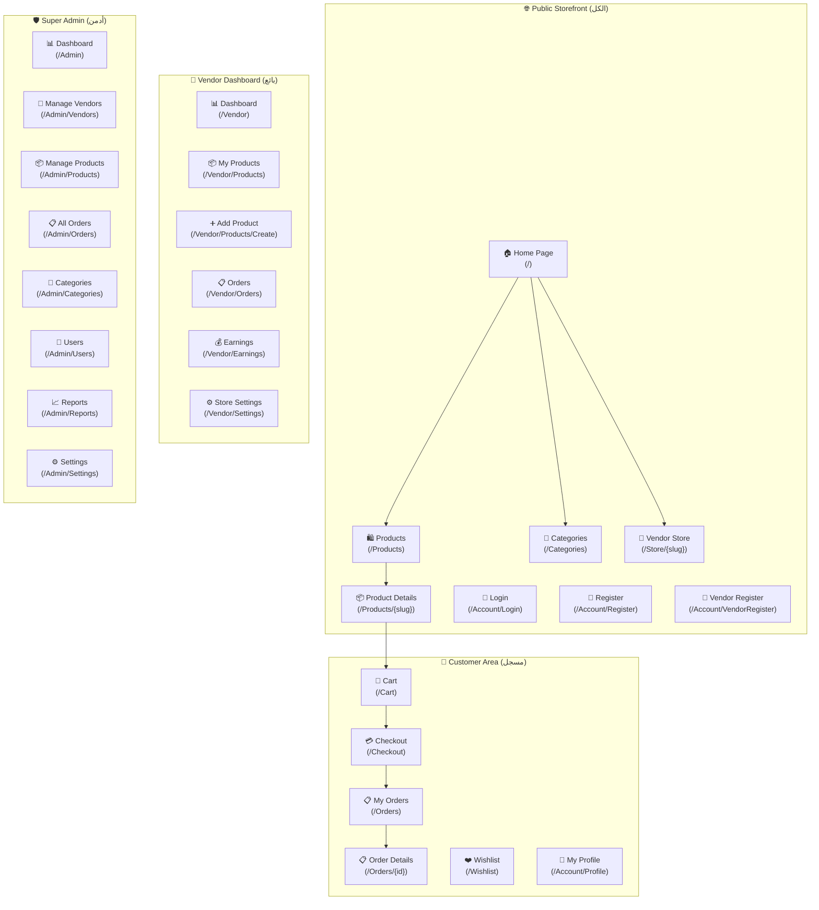

# 🛒 NexaMart — Multi-Vendor E-Commerce Marketplace Platform

> **المرجع الشامل لتصميم وهوية وبناء المشروع**  
> **المطور:** Ahmed Emad Hammad (.NET Developer | Full Stack .NET Core)  
> **بيئة العمل:** .NET 8.0 | ASP.NET Core MVC + Web API | Entity Framework Core 8 | SQL Server | ASP.NET Core Identity | SignalR  
> **تاريخ الإنشاء:** سبتمبر 2026  
> **الهدف:** بناء منصة ماركت بليس متعددة البائعين (Multi-Vendor Marketplace) احترافية تُظهر مهارات متقدمة جداً في الـ .NET Ecosystem — مُكملة لمشروع NovaMart في الـ Portfolio.

---

## 📌 فهرس المحتويات

1. [رؤية المشروع والفرق بينه وبين NovaMart](#1-رؤية-المشروع-والفرق-بينه-وبين-novamart)
2. [المشكلات الحقيقية التي يحلها NexaMart](#2-المشكلات-الحقيقية-التي-يحلها-nexamart)
3. [الهوية البصرية الكاملة (Brand Identity)](#3-الهوية-البصرية-الكاملة)
4. [المتطلبات الوظيفية وغير الوظيفية (Requirements)](#4-المتطلبات-الوظيفية-وغير-الوظيفية)
5. [الميزات التفصيلية (Features Breakdown)](#5-الميزات-التفصيلية)
6. [تصميم النظام (System Design & Architecture)](#6-تصميم-النظام)
7. [تصميم قاعدة البيانات (Database Schema Design)](#7-تصميم-قاعدة-البيانات)
8. [تصميم الـ API Endpoints](#8-تصميم-الـ-api-endpoints)
9. [دليل الواجهات والصفحات (UI/UX Pages Guide)](#9-دليل-الواجهات-والصفحات)
10. [خطة التنفيذ المرحلية (Implementation Phases)](#10-خطة-التنفيذ-المرحلية)
11. [لماذا NexaMart يُكمل NovaMart في الـ Portfolio؟](#11-لماذا-nexamart-يكمل-novamart-في-الـ-portfolio)
12. [وصف المشروع للسيرة الذاتية (CV Description)](#12-وصف-المشروع-للسيرة-الذاتية)
13. [أسئلة المقابلات المتوقعة](#13-أسئلة-المقابلات-المتوقعة)
14. [AI System Context للمحادثات المستقبلية](#14-ai-system-context)

---

## 1. رؤية المشروع والفرق بينه وبين NovaMart

### 🎯 رؤية المشروع (Vision Statement)

> **NexaMart** هي منصة سوق إلكتروني متعددة البائعين (Multi-Vendor Marketplace)، تسمح لأي بائع بإنشاء متجره الخاص داخل المنصة، رفع منتجاته، وإدارة طلباته — بينما يدير مالك المنصة (Super Admin) كل شيء من لوحة تحكم مركزية مع نظام عمولات وتقارير مالية.

### 🆚 الفرق الجوهري بين NovaMart و NexaMart

```mermaid
graph LR
    subgraph NovaMart ["🛒 NovaMart (مشروع 1)"]
        N1["متجر واحد (Single Store)"]
        N2["بائع واحد فقط"]
        N3["Admin + User فقط"]
        N4["MVC فقط"]
        N5["لا يوجد سلة أو دفع"]
        N6["Custom Auth بسيط"]
    end

    subgraph NexaMart ["🏪 NexaMart (مشروع 2)"]
        X1["ماركت بليس (Multi-Vendor)"]
        X2["بائعين متعددين (كل واحد بمتجره)"]
        X3["Super Admin + Vendor + Customer"]
        X4["MVC + Web API + SignalR"]
        X5["سلة + Checkout + Stripe Payment"]
        X6["ASP.NET Core Identity + Claims"]
    end

    NovaMart -->|"تطور إلى"| NexaMart

    style NovaMart fill:#1E293B,stroke:#059669,color:#F8FAFC
    style NexaMart fill:#1E293B,stroke:#0D9488,color:#F8FAFC
```



| المعيار | NovaMart (مشروعك الأول) | NexaMart (المشروع الجديد) |
|:---|:---|:---|
| **النموذج التجاري** | متجر واحد يبيع منتجاته | سوق يجمع بائعين متعددين |
| **الأدوار** | Admin / User | **Super Admin / Vendor / Customer** |
| **لوحات التحكم** | لوحة واحدة للأدمن | **3 لوحات:** Super Admin + Vendor + Customer Profile |
| **المنتجات** | يديرها Admin واحد | **كل بائع يدير منتجاته** |
| **الطلبات** | ❌ لا يوجد | **نظام طلبات كامل** مع تتبع الحالة |
| **الدفع** | ❌ لا يوجد | **Stripe Integration** |
| **السلة** | ❌ لا يوجد | **سلة مشتريات ذكية** (مقسمة حسب البائع) |
| **التقييمات** | ❌ لا يوجد | **تقييمات ومراجعات** للمنتجات والبائعين |
| **العمولات** | ❌ لا يوجد | **نظام عمولات** للمنصة على كل عملية بيع |
| **المصادقة** | Custom (بسيط) | **ASP.NET Core Identity** (PBKDF2 + Claims) |
| **الـ API** | ❌ MVC فقط | **REST API + SignalR** |
| **الإشعارات** | ❌ لا يوجد | **إشعارات لحظية** (طلب جديد / تحديث حالة) |

---

## 2. المشكلات الحقيقية التي يحلها NexaMart

| # | المشكلة (Pain Point) | كيف يحلها NexaMart | التقنية |
|:---:|:---|:---|:---|
| 1 | **البائع الصغير لا يقدر يبني متجر خاص** — تكلفة بناء موقع مستقل عالية | يسجل كبائع ويبدأ يبيع فوراً داخل المنصة | **Vendor Registration + Store Setup** |
| 2 | **المشتري لا يثق في بائعين مجهولين** | نظام تقييمات ومراجعات + حالة "Verified Vendor" | **Rating System + Verification Badge** |
| 3 | **صعوبة تتبع الطلبات من بائعين مختلفين** | طلب واحد يتقسم تلقائياً على البائعين مع تتبع منفصل لكل جزء | **Order Splitting + Status Tracking** |
| 4 | **مالك المنصة لا يقدر يراقب كل البائعين** | لوحة تحكم مركزية مع تقارير مبيعات + مراقبة مخزون + إدارة بائعين | **Super Admin Dashboard + Analytics** |
| 5 | **لا يوجد نظام عمولات عادل** | نسبة عمولة قابلة للتعديل لكل فئة/بائع مع تقارير مالية تلقائية | **Commission Engine + Financial Reports** |
| 6 | **تجربة بحث ضعيفة** — المنتجات من بائعين مختلفين صعب تلاقيها | بحث موحد عبر كل المنتجات مع فلاتر متقدمة | **Unified Search + Advanced Filters** |
| 7 | **لا يوجد نظام دفع آمن** | Stripe Checkout مع حماية المشتري | **Stripe Payment Gateway** |
| 8 | **البائع لا يعرف أداء متجره** | داشبورد خاص بكل بائع: مبيعات + إيرادات + منتجات أكثر مبيعاً | **Vendor Analytics Dashboard** |

---

## 3. الهوية البصرية الكاملة

### 🏷️ الاسم والشعار

| العنصر | التفاصيل |
|:---|:---|
| **اسم المنصة** | **NexaMart** |
| **المعنى** | **Nexa** = الاتصال والتواصل (من Nexus) + **Mart** = سوق. "السوق المتصل" الذي يجمع البائعين والمشترين |
| **الشعار النصي (Tagline)** | *"Where Vendors Meet Customers"* |
| **الشعار العربي** | *"سوقك، بائعينك، في مكان واحد"* |

**وصف اللوجو:** عربة تسوق مدمجة مع شبكة اتصال (Network Nodes) تعبر عن ربط البائعين بالمشترين في منصة واحدة. التدرج اللوني من الأخضر الزمردي إلى التيل يعطي إحساس بالثقة والنمو. النص "Nexa" بالأبيض و"Mart" بالأخضر على خلفية داكنة.

### اللوجو الرسمي


---

### 🎨 نظام الألوان (Color System)

#### Primary Palette (الأساسية)
| اللون | Hex | الاستخدام |
|:---|:---|:---|
| **Emerald** | `#059669` | الأزرار الرئيسية (Add to Cart, Buy Now, Confirm) |
| **Teal** | `#0D9488` | التدرجات، الـ Hover States، الـ Active Elements |
| **Emerald Light** | `#34D399` | الـ Badges (Verified, In Stock)، الأيقونات الإيجابية |

#### Accent & Semantic Colors
| اللون | Hex | الاستخدام |
|:---|:---|:---|
| **Amber** | `#F59E0B` | نجوم التقييم، التحذيرات، الـ "Pending" Status |
| **Orange** | `#F97316` | العروض والخصومات، الـ Sale Badge |
| **Rose Red** | `#EF4444` | الأخطاء، المنتجات المنتهية، الـ "Rejected" Status |
| **Sky Blue** | `#0EA5E9` | المعلومات، الـ "Shipped" Status، الروابط |
| **Indigo** | `#6366F1` | بادجات الـ Vendor، عناصر الـ Admin |

#### Dark Theme (الوضع الداكن — الافتراضي)
| العنصر | Hex | الوصف |
|:---|:---|:---|
| **Background Primary** | `#0A0F1E` | الخلفية الرئيسية (أغمق من NovaMart) |
| **Background Secondary** | `#111827` | خلفية الكروت والـ Sidebar (Gray 900) |
| **Background Tertiary** | `#1F2937` | خلفية العناصر المحددة (Gray 800) |
| **Surface** | `#374151` | الحدود والفواصل (Gray 700) |
| **Text Primary** | `#F9FAFB` | النصوص الرئيسية |
| **Text Secondary** | `#9CA3AF` | النصوص الفرعية (Gray 400) |
| **Text Muted** | `#6B7280` | النصوص الخافتة (Gray 500) |

#### Light Theme (الوضع الفاتح)
| العنصر | Hex |
|:---|:---|
| **Background** | `#F9FAFB` |
| **Surface** | `#FFFFFF` |
| **Text Primary** | `#111827` |
| **Text Secondary** | `#4B5563` |

---

### 🔤 نظام الخطوط (Typography)

| الاستخدام | الخط | الوزن |
|:---|:---|:---|
| **العناوين (Headings)** | **Outfit** | Bold (700) / Semi-Bold (600) |
| **النص الأساسي (Body)** | **Inter** | Regular (400) / Medium (500) |
| **الأسعار والأرقام** | **JetBrains Mono** | Medium (500) |

```css
/* Design Tokens */
--font-heading: 'Outfit', sans-serif;
--font-body: 'Inter', sans-serif;
--font-mono: 'JetBrains Mono', monospace;

/* Colors */
--color-primary: #059669;
--color-primary-hover: #0D9488;
--color-primary-light: #34D399;
--color-bg-primary: #0A0F1E;
--color-bg-secondary: #111827;
--color-bg-tertiary: #1F2937;
--color-text-primary: #F9FAFB;
--color-text-secondary: #9CA3AF;

/* Spacing */
--space-1: 0.25rem;  --space-2: 0.5rem;  --space-3: 0.75rem;
--space-4: 1rem;     --space-6: 1.5rem;  --space-8: 2rem;
--space-10: 2.5rem;  --space-12: 3rem;   --space-16: 4rem;

/* Border Radius */
--radius-sm: 6px;  --radius-md: 8px;  --radius-lg: 12px;  --radius-xl: 16px;

/* Shadows */
--shadow-sm: 0 1px 3px rgba(0, 0, 0, 0.4);
--shadow-md: 0 4px 8px rgba(0, 0, 0, 0.4);
--shadow-lg: 0 10px 25px rgba(0, 0, 0, 0.4);
--shadow-glow: 0 0 20px rgba(5, 150, 105, 0.25);

/* Transitions */
--transition-fast: 150ms ease;
--transition-base: 250ms ease;
--transition-slow: 350ms ease;
```

---

## 4. المتطلبات الوظيفية وغير الوظيفية

### ✅ المتطلبات الوظيفية (Functional Requirements)

#### FR-01: نظام المصادقة والتسجيل (Authentication & Registration)
| # | المتطلب | الأولوية | الدور |
|:---:|:---|:---:|:---:|
| FR-01.1 | تسجيل حساب كمشتري (Customer) | 🔴 عالية | Customer |
| FR-01.2 | تسجيل حساب كبائع (Vendor) مع بيانات المتجر | 🔴 عالية | Vendor |
| FR-01.3 | تسجيل الدخول عبر ASP.NET Core Identity (PBKDF2) | 🔴 عالية | الكل |
| FR-01.4 | تأكيد البريد الإلكتروني (Email Confirmation) | 🟡 متوسطة | الكل |
| FR-01.5 | إعادة تعيين كلمة المرور (Forgot Password) | 🟡 متوسطة | الكل |
| FR-01.6 | تسجيل دخول خارجي (Google OAuth 2.0) | 🟢 منخفضة | الكل |

#### FR-02: واجهة المتجر العامة (Public Storefront)
| # | المتطلب | الأولوية |
|:---:|:---|:---:|
| FR-02.1 | الصفحة الرئيسية: عروض مميزة + أحدث المنتجات + أقسام شائعة + بائعين مميزين | 🔴 عالية |
| FR-02.2 | تصفح المنتجات مع Pagination + فلترة بالقسم + النطاق السعري + التقييم + البائع | 🔴 عالية |
| FR-02.3 | بحث شامل في كل المنتجات بالاسم والوصف (Full-Text Search) | 🔴 عالية |
| FR-02.4 | ترتيب المنتجات: أحدث / سعر تصاعدي / سعر تنازلي / الأعلى تقييماً / الأكثر مبيعاً | 🔴 عالية |
| FR-02.5 | صفحة تفاصيل المنتج: معرض صور + وصف + سعر + بائع + تقييمات + "Add to Cart" | 🔴 عالية |
| FR-02.6 | صفحة متجر البائع (Vendor Store Page): كل منتجات بائع معين + تقييمه + معلوماته | 🔴 عالية |
| FR-02.7 | تصفح الأقسام (Categories) مع صور وعداد المنتجات | 🔴 عالية |

#### FR-03: سلة المشتريات (Shopping Cart)
| # | المتطلب | الأولوية |
|:---:|:---|:---:|
| FR-03.1 | إضافة منتجات للسلة (مع اختيار الكمية) | 🔴 عالية |
| FR-03.2 | تعديل الكمية وحذف المنتجات من السلة | 🔴 عالية |
| FR-03.3 | **تقسيم السلة حسب البائع** (Grouped by Vendor) — كل بائع مجموعة منفصلة | 🔴 عالية |
| FR-03.4 | حساب المجموع الفرعي لكل بائع + الإجمالي الكلي + الشحن | 🔴 عالية |
| FR-03.5 | حفظ السلة في الـ Database للمستخدم المسجل | 🔴 عالية |
| FR-03.6 | دمج السلة عند تسجيل الدخول (Session Cart → DB Cart) | 🟡 متوسطة |

#### FR-04: نظام الطلبات (Order Management)
| # | المتطلب | الأولوية |
|:---:|:---|:---:|
| FR-04.1 | صفحة Checkout: عنوان الشحن + طريقة الدفع + ملخص الطلب | 🔴 عالية |
| FR-04.2 | **تقسيم الطلب الواحد إلى Sub-Orders** (كل بائع يستلم طلبه الخاص) | 🔴 عالية |
| FR-04.3 | حالات الطلب: `Pending → Confirmed → Processing → Shipped → Delivered → Cancelled` | 🔴 عالية |
| FR-04.4 | تتبع الطلب (Order Tracking) للمشتري | 🔴 عالية |
| FR-04.5 | البائع يحدّث حالة طلبه (Confirm → Ship → Deliver) | 🔴 عالية |
| FR-04.6 | إلغاء الطلب (قبل الشحن فقط) | 🟡 متوسطة |
| FR-04.7 | تاريخ الطلبات (Order History) للمشتري | 🔴 عالية |

#### FR-05: نظام الدفع (Payment)
| # | المتطلب | الأولوية |
|:---:|:---|:---:|
| FR-05.1 | دفع عبر Stripe Checkout Session | 🔴 عالية |
| FR-05.2 | Stripe Webhook لتأكيد الدفع تلقائياً | 🔴 عالية |
| FR-05.3 | حساب العمولة تلقائياً عند كل عملية بيع | 🔴 عالية |
| FR-05.4 | الدفع عند الاستلام (COD) كخيار إضافي | 🟡 متوسطة |

#### FR-06: نظام التقييمات والمراجعات (Reviews & Ratings)
| # | المتطلب | الأولوية |
|:---:|:---|:---:|
| FR-06.1 | تقييم المنتج (1-5 نجوم) مع مراجعة نصية | 🔴 عالية |
| FR-06.2 | تقييم البائع (Vendor Rating) — متوسط تقييمات كل منتجاته | 🔴 عالية |
| FR-06.3 | عرض التقييمات مع بيانات المراجع (اسم + تاريخ + نجوم) | 🔴 عالية |
| FR-06.4 | يمكن فقط للمشترين الذين اشتروا المنتج تقييمه (Verified Purchase) | 🟡 متوسطة |

#### FR-07: لوحة تحكم البائع (Vendor Dashboard)
| # | المتطلب | الأولوية |
|:---:|:---|:---:|
| FR-07.1 | إدارة المنتجات: CRUD + رفع صور متعددة + تحديد القسم والسعر والمخزون | 🔴 عالية |
| FR-07.2 | إدارة الطلبات الواردة: عرض + تأكيد + شحن + تسليم | 🔴 عالية |
| FR-07.3 | KPI Dashboard: إجمالي المبيعات + الإيرادات + المنتجات + الطلبات الجديدة | 🔴 عالية |
| FR-07.4 | رسوم بيانية: مبيعات آخر 30 يوم + أكثر المنتجات مبيعاً | 🟡 متوسطة |
| FR-07.5 | إعدادات المتجر: اسم المتجر + الوصف + اللوجو + بيانات التواصل | 🔴 عالية |
| FR-07.6 | عرض تقرير العمولات والأرباح الصافية | 🔴 عالية |

#### FR-08: لوحة تحكم Super Admin
| # | المتطلب | الأولوية |
|:---:|:---|:---:|
| FR-08.1 | إدارة البائعين: عرض + موافقة + تعليق + حذف + تغيير الحالة | 🔴 عالية |
| FR-08.2 | إدارة الأقسام (Categories): CRUD + صورة القسم | 🔴 عالية |
| FR-08.3 | إدارة المنتجات: مراجعة + موافقة + رفض + حذف أي منتج | 🔴 عالية |
| FR-08.4 | إدارة الطلبات: عرض كل الطلبات مع فلاتر متقدمة | 🔴 عالية |
| FR-08.5 | KPI Dashboard مركزي: إجمالي المبيعات + البائعين + المنتجات + الإيرادات + العمولات | 🔴 عالية |
| FR-08.6 | إعدادات العمولة: تحديد نسبة العمولة العامة ولكل فئة | 🔴 عالية |
| FR-08.7 | تقارير مالية: إجمالي العمولات المحصلة + أداء البائعين + أكثر المنتجات مبيعاً | 🟡 متوسطة |
| FR-08.8 | إدارة المستخدمين (Customers): عرض + تعليق + حذف | 🟡 متوسطة |

#### FR-09: الإشعارات (Notifications)
| # | المتطلب | الأولوية |
|:---:|:---|:---:|
| FR-09.1 | إشعار لحظي للبائع عند وصول طلب جديد (SignalR) | 🔴 عالية |
| FR-09.2 | إشعار للمشتري عند تحديث حالة الطلب | 🔴 عالية |
| FR-09.3 | إشعار للبائع عند موافقة/رفض منتجه من الأدمن | 🟡 متوسطة |
| FR-09.4 | إشعار بالبريد الإلكتروني لتأكيد الطلب | 🟡 متوسطة |

#### FR-10: قائمة الأمنيات (Wishlist)
| # | المتطلب | الأولوية |
|:---:|:---|:---:|
| FR-10.1 | إضافة/إزالة المنتجات من قائمة الأمنيات | 🟡 متوسطة |
| FR-10.2 | عرض قائمة الأمنيات مع إمكانية النقل للسلة | 🟡 متوسطة |

---

### ⚙️ المتطلبات غير الوظيفية (Non-Functional Requirements)

| # | المتطلب | المعيار |
|:---:|:---|:---|
| NFR-01 | **الأداء** | تحميل صفحة المنتجات في أقل من 2 ثانية مع 1000+ منتج |
| NFR-02 | **الأمان** | ASP.NET Core Identity + PBKDF2 + Anti-Forgery + Input Validation + HTTPS |
| NFR-03 | **التوسعية** | Server-Side Pagination + Lazy Loading + Async/Await |
| NFR-04 | **التجاوبية** | Responsive Design يعمل على Desktop + Tablet + Mobile |
| NFR-05 | **الـ SEO** | عناوين ديناميكية + Meta Tags + Semantic HTML |
| NFR-06 | **قابلية الصيانة** | Clean Architecture + SOLID + DI |
| NFR-07 | **الدفع الآمن** | PCI DSS Compliance عبر Stripe (لا نخزن بيانات بطاقات) |
| NFR-08 | **رفع الصور** | دعم رفع حتى 5 صور للمنتج (Max 2MB لكل صورة) |

---

## 5. الميزات التفصيلية

### 🏆 جدول مقارنة المهارات الجديدة

| الميزة في NexaMart | المهارة التقنية الجديدة | هل كانت في NovaMart؟ |
|:---|:---|:---:|
| **Multi-Vendor Architecture** | Multi-Tenancy + Data Isolation per Vendor | ❌ |
| **3 Dashboards مختلفة** | Role-Based Layouts + View Components | ⚡ لوحة واحدة فقط |
| **Shopping Cart (DB-backed)** | Cart Service + Session Management | ❌ |
| **Order Splitting by Vendor** | Complex Business Logic + Transactions | ❌ |
| **Stripe Payment Gateway** | 3rd Party API Integration + Webhooks | ❌ |
| **Commission Calculation** | Automated Financial Logic | ❌ |
| **Image Upload (Multiple)** | IFormFile + Image Processing | ❌ روابط فقط |
| **Product Reviews & Ratings** | Aggregation Queries + Star System | ❌ |
| **Vendor Application & Approval** | Workflow State Machine | ❌ |
| **Real-Time Order Notifications** | SignalR Hubs + Push Notifications | ❌ |
| **Advanced Filters (Price Range)** | Range Sliders + Expression Trees | ⚡ فلتر قسم فقط |
| **Charts & Analytics** | Chart.js + Complex SQL Aggregations | ⚡ KPI بدون Charts |
| **Wishlist** | User-scoped persistent lists | ❌ |
| **Email Service** | SMTP/SendGrid Integration | ❌ |
| **ASP.NET Core Identity** | Enterprise-grade Auth System | ❌ Custom Auth |

---

## 6. تصميم النظام

### 🏛️ هيكلية النظام (System Architecture)



---

### 📂 هيكلية المجلدات (Solution Structure — Onion Architecture)

> للمزيد من التفاصيل الدقيقة المعمارية، راجع ملف [ONION_ARCHITECTURE.md](./ONION_ARCHITECTURE.md).

```
NexaMart/
├── NexaMart.sln
│
├── NexaMart.Domain/                            # 1. Core Domain Layer (لا يعتمد على أي مشروع آخر)
│   ├── Common/
│   │   └── BaseEntity.cs                       # Id, CreatedAt, UpdatedAt
│   ├── Enums/
│   │   ├── OrderStatus.cs
│   │   ├── VendorStatus.cs
│   │   ├── PaymentStatus.cs
│   │   ├── NotificationType.cs
│   │   └── CommissionStatus.cs
│   └── Entities/
│       ├── ApplicationUser.cs                  # IdentityUser
│       ├── Vendor.cs                           # بيانات البائع ومتجره
│       ├── VendorApplication.cs                # طلبات الانضمام
│       ├── Category.cs                         # الأقسام
│       ├── Product.cs                          # المنتجات
│       ├── ProductImage.cs                     # صور متعددة للمنتج
│       ├── CartItem.cs                         # عناصر السلة
│       ├── Order.cs                            # الطلب العام
│       ├── OrderItem.cs                        # تفاصيل المنتجات في الطلب
│       ├── SubOrder.cs                         # طلب مجزأ لكل بائع
│       ├── Payment.cs                          # سجلات الدفع (Stripe)
│       ├── Review.cs                           # التقييمات والمراجعات
│       ├── WishlistItem.cs                     # قائمة المفضلة
│       ├── Commission.cs                       # سجل العمولات
│       ├── Notification.cs                     # الإشعارات
│       └── ShippingAddress.cs                  # عناوين الشحن
│
├── NexaMart.Application/                       # 2. Core Application Layer (يعتمد فقط على Domain)
│   ├── Interfaces/
│   │   ├── Repositories/
│   │   │   ├── IGenericRepository.cs
│   │   │   └── IUnitOfWork.cs
│   │   └── Services/
│   │       ├── IProductService.cs
│   │       ├── ICartService.cs
│   │       ├── IOrderService.cs
│   │       ├── IPaymentService.cs
│   │       ├── IVendorService.cs
│   │       ├── ICategoryService.cs
│   │       ├── IReviewService.cs
│   │       ├── INotificationService.cs
│   │       ├── ICommissionService.cs
│   │       ├── IAnalyticsService.cs
│   │       ├── IWishlistService.cs
│   │       ├── IFileStorageService.cs
│   │       └── IEmailService.cs
│   ├── DTOs/
│   │   ├── Products/                           # ProductDto, CreateProductDto, FilterDto
│   │   ├── Orders/                             # CreateOrderDto, SubOrderDto, OrderSummaryDto
│   │   ├── Cart/                               # AddToCartDto, CartDto
│   │   ├── Vendors/                            # VendorApplicationDto, VendorDashboardDto
│   │   ├── Reviews/                            # CreateReviewDto, ReviewDto
│   │   ├── Admin/                              # AdminDashboardDto, CommissionReportDto
│   │   └── Common/                             # DashboardChartDto, PagedResultDto
│   ├── Services/                               # Business Logic Implementations
│   │   ├── ProductService.cs
│   │   ├── CartService.cs
│   │   ├── OrderService.cs
│   │   ├── VendorService.cs
│   │   ├── CategoryService.cs
│   │   └── CommissionService.cs
│   └── Mapping/
│       └── MappingExtensions.cs
│
├── NexaMart.Infrastructure/                    # 3. Infrastructure Layer (يعتمد على Application و Domain)
│   ├── Data/
│   │   ├── Context/
│   │   │   └── NexaMartDbContext.cs            # IdentityDbContext<ApplicationUser>
│   │   ├── Configurations/                     # Fluent API (Product, Order, Vendor, Category)
│   │   └── Migrations/                         # EF Core Migrations
│   ├── Repositories/
│   │   ├── GenericRepository.cs
│   │   └── UnitOfWork.cs
│   ├── Seeding/
│   │   └── DbInitializer.cs                    # بيانات أولية غنية
│   └── Services/
│       ├── StripePaymentService.cs             # Stripe Checkout & Webhooks
│       ├── LocalFileStorageService.cs          # حفظ الصور بـ wwwroot/uploads
│       └── SmtpEmailService.cs                 # إرسال البريد
│
├── NexaMart.Web/                               # 4. Presentation Layer (يعتمد على Application و Infrastructure)
│   ├── Controllers/                            # Public Storefront
│   │   ├── HomeController.cs
│   │   ├── AccountController.cs
│   │   ├── ProductController.cs
│   │   ├── CategoryController.cs
│   │   ├── CartController.cs
│   │   ├── CheckoutController.cs
│   │   ├── OrderController.cs                 # Customer order history
│   │   ├── VendorStoreController.cs           # Public vendor store page
│   │   ├── ReviewController.cs
│   │   └── WishlistController.cs
│   ├── Areas/
│   │   ├── Vendor/Controllers/                # Vendor Dashboard
│   │   │   ├── VendorDashboardController.cs
│   │   │   ├── VendorProductController.cs
│   │   │   ├── VendorOrderController.cs
│   │   │   └── VendorSettingsController.cs
│   │   └── Admin/Controllers/                 # Super Admin Dashboard
│   │       ├── AdminDashboardController.cs
│   │       ├── AdminVendorController.cs
│   │       ├── AdminProductController.cs
│   │       ├── AdminOrderController.cs
│   │       ├── AdminCategoryController.cs
│   │       ├── AdminUserController.cs
│   │       └── AdminReportController.cs
│   ├── ApiControllers/
│   │   ├── CartApiController.cs               # AJAX cart operations
│   │   ├── ReviewApiController.cs
│   │   ├── WishlistApiController.cs
│   │   ├── NotificationApiController.cs
│   │   └── StripeWebhookController.cs         # Stripe callback
│   ├── Hubs/
│   │   ├── OrderHub.cs                        # Real-time order updates
│   │   └── NotificationHub.cs
│   ├── ViewModels/
│   │   ├── HomeViewModel.cs
│   │   ├── ProductListViewModel.cs
│   │   ├── ProductDetailsViewModel.cs
│   │   ├── CartViewModel.cs
│   │   ├── CheckoutViewModel.cs
│   │   ├── VendorDashboardViewModel.cs
│   │   └── AdminDashboardViewModel.cs
│   ├── ViewComponents/
│   │   ├── CartIconViewComponent.cs           # عداد السلة في الـ Navbar
│   │   ├── NotificationBellViewComponent.cs
│   │   └── VendorBadgeViewComponent.cs
│   ├── Views/
│   │   ├── Shared/
│   │   │   ├── _Layout.cshtml                 # Layout العام (Customers)
│   │   │   ├── _VendorLayout.cshtml           # Layout البائع
│   │   │   ├── _AdminLayout.cshtml            # Layout الأدمن
│   │   │   ├── _Navbar.cshtml
│   │   │   ├── _Footer.cshtml
│   │   │   └── _Notifications.cshtml
│   │   ├── Home/
│   │   ├── Account/
│   │   ├── Product/
│   │   ├── Category/
│   │   ├── Cart/
│   │   ├── Checkout/
│   │   ├── Order/
│   │   ├── VendorStore/
│   │   ├── Review/
│   │   └── Wishlist/
│   │   ├── Areas/Vendor/Views/
│   │   └── Areas/Admin/Views/
│   ├── wwwroot/
│   │   ├── css/
│   │   │   ├── site.css                       # Design System
│   │   │   ├── storefront.css                 # Public pages
│   │   │   ├── vendor-dashboard.css           # Vendor dashboard
│   │   │   ├── admin-dashboard.css            # Admin dashboard
│   │   │   └── dark-theme.css
│   │   ├── js/
│   │   │   ├── cart.js                        # AJAX cart operations
│   │   │   ├── wishlist.js
│   │   │   ├── reviews.js
│   │   │   ├── image-upload.js                # Multi-image preview & upload
│   │   │   ├── signalr-orders.js              # Real-time order updates
│   │   │   ├── signalr-notifications.js
│   │   │   ├── charts.js                      # Dashboard charts (Chart.js)
│   │   │   ├── price-range-slider.js          # Price filter slider
│   │   │   └── stripe-checkout.js
│   │   ├── uploads/
│   │   │   ├── products/                      # Product images
│   │   │   ├── vendors/                       # Vendor logos
│   │   │   └── categories/                    # Category images
│   │   └── images/                            # Static assets
│   ├── appsettings.json
│   └── Program.cs
│
└── NexaMart.Tests/
    ├── Services/
    │   ├── CartServiceTests.cs
    │   ├── OrderServiceTests.cs
    │   └── CommissionServiceTests.cs
    └── Controllers/
```

---

## 7. تصميم قاعدة البيانات

### 📊 Entity Relationship Diagram (ERD)

```mermaid
erDiagram
    ApplicationUser ||--o| Vendor : "can be"
    ApplicationUser ||--o{ CartItem : "has cart"
    ApplicationUser ||--o{ Order : "places"
    ApplicationUser ||--o{ Review : "writes"
    ApplicationUser ||--o{ WishlistItem : "has wishlist"
    ApplicationUser ||--o{ Notification : "receives"
    ApplicationUser ||--o{ ShippingAddress : "has addresses"

    Vendor ||--o{ Product : "sells"
    Vendor ||--o{ SubOrder : "receives"
    Vendor ||--o{ Commission : "pays"
    Vendor {
        int Id PK
        string UserId FK
        string StoreName
        string StoreDescription
        string LogoUrl
        string BannerUrl
        string ContactPhone
        string BusinessAddress
        decimal AverageRating
        int TotalSales
        string Status "Pending|Approved|Suspended|Rejected"
        decimal CommissionRate "default 10%"
        datetime ApprovedAt
        datetime CreatedAt
    }

    Category ||--o{ Product : "contains"
    Category {
        int Id PK
        string Name
        string Description
        string ImageUrl
        string Slug
        int ParentCategoryId FK "nullable - for sub-categories"
        bool IsActive
        decimal CategoryCommissionRate "nullable - override default"
    }

    Product ||--o{ ProductImage : "has images"
    Product ||--o{ CartItem : "in carts"
    Product ||--o{ OrderItem : "in orders"
    Product ||--o{ Review : "has reviews"
    Product ||--o{ WishlistItem : "in wishlists"
    Product {
        int Id PK
        string Name
        string Description
        decimal Price
        decimal OriginalPrice "for showing discount"
        int StockQuantity
        string SKU
        string Slug
        decimal AverageRating
        int ReviewCount
        int SoldCount
        bool IsApproved "Admin approval"
        bool IsActive
        int CategoryId FK
        int VendorId FK
        datetime CreatedAt
        datetime UpdatedAt
    }

    ProductImage {
        int Id PK
        string ImageUrl
        bool IsPrimary
        int DisplayOrder
        int ProductId FK
    }

    CartItem {
        int Id PK
        string UserId FK
        int ProductId FK
        int Quantity
        datetime AddedAt
    }

    Order ||--o{ OrderItem : "contains"
    Order ||--o{ SubOrder : "splits into"
    Order ||--|  Payment : "paid by"
    Order {
        int Id PK
        string OrderNumber "NXM-20260001"
        string UserId FK
        decimal SubTotal
        decimal ShippingFee
        decimal TotalAmount
        string Status "Pending|Confirmed|Delivered|Cancelled"
        int ShippingAddressId FK
        string PaymentMethod "Stripe|COD"
        datetime CreatedAt
    }

    OrderItem {
        int Id PK
        int OrderId FK
        int SubOrderId FK
        int ProductId FK
        int VendorId FK
        string ProductName "snapshot"
        decimal UnitPrice "snapshot"
        int Quantity
        decimal TotalPrice
    }

    SubOrder {
        int Id PK
        int OrderId FK
        int VendorId FK
        string SubOrderNumber "NXM-20260001-V1"
        decimal SubTotal
        decimal CommissionAmount
        decimal VendorEarnings
        string Status "Pending|Confirmed|Processing|Shipped|Delivered|Cancelled"
        string TrackingNumber
        datetime StatusUpdatedAt
    }

    Payment {
        int Id PK
        int OrderId FK
        string StripeSessionId
        string StripePaymentIntentId
        decimal Amount
        string Currency "EGP|USD"
        string Status "Pending|Succeeded|Failed|Refunded"
        datetime PaidAt
    }

    Review {
        int Id PK
        int Rating "1-5"
        string Comment
        bool IsVerifiedPurchase
        int ProductId FK
        string UserId FK
        datetime CreatedAt
    }

    Commission {
        int Id PK
        int SubOrderId FK
        int VendorId FK
        decimal OrderAmount
        decimal CommissionRate
        decimal CommissionAmount
        decimal VendorPayout
        string Status "Pending|Paid|Cancelled"
        datetime CreatedAt
    }

    WishlistItem {
        int Id PK
        string UserId FK
        int ProductId FK
        datetime AddedAt
    }

    ShippingAddress {
        int Id PK
        string UserId FK
        string FullName
        string Phone
        string AddressLine1
        string AddressLine2
        string City
        string State
        string PostalCode
        string Country
        bool IsDefault
    }

    Notification {
        int Id PK
        string UserId FK
        string Title
        string Message
        string Type "NewOrder|OrderUpdate|VendorApproved|NewReview"
        string Link
        bool IsRead
        datetime CreatedAt
    }

    ApplicationUser {
        string Id PK
        string FullName
        string AvatarUrl
        string PhoneNumber
    }
```

---

## 8. تصميم الـ API Endpoints

### 🔌 RESTful API Endpoints

#### Cart API (`/api/cart`) — AJAX Operations
```
GET    /api/cart                          → جلب محتويات السلة (مقسمة بالبائع)
POST   /api/cart/add                      → إضافة منتج للسلة { productId, quantity }
PUT    /api/cart/{itemId}                  → تعديل الكمية { quantity }
DELETE /api/cart/{itemId}                  → حذف منتج من السلة
GET    /api/cart/count                    → عدد العناصر في السلة (للـ Navbar Badge)
DELETE /api/cart/clear                    → تفريغ السلة بالكامل
```

#### Reviews API (`/api/reviews`)
```
POST   /api/reviews                       → إضافة تقييم { productId, rating, comment }
GET    /api/reviews/product/{productId}   → جلب تقييمات منتج مع Pagination
DELETE /api/reviews/{id}                  → حذف تقييم (صاحبه أو Admin)
```

#### Wishlist API (`/api/wishlist`)
```
POST   /api/wishlist/toggle/{productId}   → إضافة/إزالة من الـ Wishlist (Toggle)
GET    /api/wishlist                      → جلب قائمة الأمنيات
POST   /api/wishlist/{id}/move-to-cart    → نقل منتج من الـ Wishlist للسلة
```

#### Notifications API (`/api/notifications`)
```
GET    /api/notifications                 → جلب الإشعارات مع Pagination
PUT    /api/notifications/{id}/read       → تحديد إشعار كمقروء
PUT    /api/notifications/read-all        → تحديد الكل كمقروء
GET    /api/notifications/unread-count    → عدد الإشعارات غير المقروءة
```

#### Stripe Webhook (`/api/stripe/webhook`)
```
POST   /api/stripe/webhook                → استقبال أحداث Stripe (payment_intent.succeeded, etc.)
```

### 🔄 SignalR Hubs

#### OrderHub (Real-Time Order Updates)
```csharp
// Events: Server → Client
NewOrderReceived(subOrderData)            → للبائع: وصلك طلب جديد!
OrderStatusUpdated(orderId, newStatus)    → للمشتري: تم تحديث حالة طلبك

// Methods: Client → Server
JoinVendorRoom(vendorId)                  → البائع يدخل غرفته لاستقبال الطلبات
JoinCustomerRoom(userId)                  → المشتري يدخل غرفته لمتابعة طلباته
```

#### NotificationHub
```csharp
NewNotification(notification)             → إشعار جديد
UpdateNotificationCount(count)            → تحديث عداد الإشعارات
```

---

## 9. دليل الواجهات والصفحات

### 🖥️ خريطة الصفحات (Sitemap)



---

### 📄 تفاصيل الصفحات الرئيسية

#### 1. 🏠 Home Page (`/`)
| العنصر | التفاصيل |
|:---|:---|
| **Hero Section** | بانر كبير بتدرج Emerald→Teal + عنوان "Discover Products from Top Vendors" + Search Bar + CTA |
| **Featured Products** | Carousel/Grid بأحدث أو أعلى المنتجات تقييماً (6-8 منتجات) |
| **Categories Grid** | كروت الأقسام مع صور + عداد المنتجات (Hover effect) |
| **Top Vendors** | كروت البائعين المميزين مع Logo + Store Name + Rating + عدد المنتجات |
| **Deals Section** | منتجات بخصومات (OriginalPrice vs Price) مع عداد تنازلي |
| **Footer** | روابط سريعة + تواصل + Social Media |

#### 2. 🛍️ Products Page (`/Products`)
| العنصر | التفاصيل |
|:---|:---|
| **Sidebar Filters** | فلتر القسم (Checkboxes) + نطاق السعر (Range Slider) + التقييم (Stars) + البائع |
| **Sort Bar** | Dropdown: أحدث / سعر ↑ / سعر ↓ / أعلى تقييم / أكثر مبيعاً |
| **Product Grid** | كروت المنتجات: صورة + اسم + سعر + تقييم (نجوم) + اسم البائع + زر "Add to Cart" |
| **Pagination** | Server-Side Pagination مع حفظ الفلاتر |

#### 3. 📦 Product Details (`/Products/{slug}`)
| العنصر | التفاصيل |
|:---|:---|
| **Image Gallery** | Thumbnail carousel (حتى 5 صور) مع Zoom on hover |
| **Info Section** | اسم + سعر (مع خصم إن وجد) + تقييم متوسط + عدد المراجعات + حالة المخزون |
| **Vendor Card** | اسم المتجر + Logo + تقييم البائع + رابط "Visit Store" |
| **Actions** | اختيار الكمية + "Add to Cart" + "Add to Wishlist" ❤️ |
| **Tabs** | Description / Reviews & Ratings / Vendor Info |
| **Related Products** | Grid بمنتجات مشابهة من نفس القسم |

#### 4. 🛒 Cart Page (`/Cart`)
| العنصر | التفاصيل |
|:---|:---|
| **التصميم المميز** | **السلة مقسمة حسب البائع** — كل بائع مجموعة منفصلة بـ Header فيه اسم المتجر ولوجوه |
| **كل مجموعة** | جدول: صورة + اسم + سعر + كمية (قابلة للتعديل AJAX) + مجموع + حذف |
| **Sub-total per Vendor** | المجموع الفرعي لكل بائع |
| **Order Summary** | Subtotal + Shipping + **Total** + زر "Proceed to Checkout" |

#### 5. 💳 Checkout Page (`/Checkout`)
| العنصر | التفاصيل |
|:---|:---|
| **Step 1** | اختيار/إضافة عنوان الشحن |
| **Step 2** | اختيار طريقة الدفع (Stripe / COD) |
| **Step 3** | مراجعة الطلب (ملخص مقسم بالبائع) + تأكيد |
| **Stripe** | Redirect to Stripe Checkout Session → Return to Success/Cancel |

#### 6. 📊 Vendor Dashboard (`/Vendor`)
| العنصر | التفاصيل |
|:---|:---|
| **Layout** | Sidebar خاص بالبائع (أخضر/تيل) + Navbar مع اسم المتجر |
| **KPI Cards** | Total Revenue / Total Orders / Products Listed / Average Rating |
| **Charts** | Line Chart (مبيعات آخر 30 يوم) + Donut Chart (حالة الطلبات) |
| **Recent Orders** | آخر 5 طلبات واردة مع حالتها + زر "View All" |
| **Top Products** | أكثر 5 منتجات مبيعاً مع الكمية والإيرادات |

#### 7. 🛡️ Super Admin Dashboard (`/Admin`)
| العنصر | التفاصيل |
|:---|:---|
| **Layout** | Sidebar داكن (Indigo) + Navbar مع بادج "Super Admin" |
| **KPI Cards** | Total Revenue / Total Commission / Active Vendors / Total Products / Total Orders / Pending Approvals |
| **Charts** | Bar Chart (إيرادات شهرية) + Pie Chart (توزيع المبيعات بالقسم) + Line Chart (نمو البائعين) |
| **Pending Actions** | بائعين ينتظرون الموافقة + منتجات تحتاج مراجعة |
| **Recent Activity** | آخر الطلبات + آخر البائعين المسجلين + آخر المنتجات المضافة |

---

## 10. خطة التنفيذ المرحلية

### 📅 Implementation Phases (14 أسبوع)

#### 🟢 Phase 1: Foundation & Auth (الأسبوع 1-2)
- [ ] إنشاء Solution بـ 3 Projects (DAL, BLL, Web)
- [ ] إعداد `NexaMartDbContext` مع كل الـ Entities والعلاقات
- [ ] تطبيق ASP.NET Core Identity مع 3 أدوار: SuperAdmin, Vendor, Customer
- [ ] بناء Generic Repository + Unit of Work
- [ ] صفحات Register / Login / Vendor Registration
- [ ] الـ Layouts الثلاثة: Public + Vendor + Admin (مع Dark Theme)
- [ ] EF Core Migrations + DbInitializer (Seed Data)

#### 🟢 Phase 2: Public Storefront (الأسبوع 3-4)
- [ ] الصفحة الرئيسية (Hero + Featured + Categories + Top Vendors)
- [ ] صفحة المنتجات مع Pagination + فلترة + ترتيب
- [ ] صفحة تفاصيل المنتج (Gallery + Info + Related Products)
- [ ] صفحة الأقسام
- [ ] صفحة متجر البائع (Vendor Store Page)
- [ ] البحث الشامل

#### 🟢 Phase 3: Shopping Cart & Wishlist (الأسبوع 5-6)
- [ ] Cart Service + AJAX Cart Operations
- [ ] تقسيم السلة حسب البائع (Grouped Cart View)
- [ ] View Component: Cart Icon مع عداد في الـ Navbar
- [ ] Wishlist (Add/Remove/Move to Cart)
- [ ] حفظ السلة في الـ DB للمستخدم المسجل

#### 🟢 Phase 4: Orders & Payment (الأسبوع 7-9)
- [ ] صفحة Checkout (عنوان + دفع + مراجعة)
- [ ] Order Creation مع **تقسيم الطلب لـ Sub-Orders حسب البائع**
- [ ] حساب العمولة تلقائياً عند كل طلب
- [ ] Stripe Checkout Session Integration
- [ ] Stripe Webhook لتأكيد الدفع
- [ ] صفحة Order Tracking للمشتري
- [ ] تاريخ الطلبات (Order History)

#### 🟢 Phase 5: Vendor Dashboard (الأسبوع 10-11)
- [ ] Vendor Dashboard مع KPI Cards + Charts
- [ ] إدارة المنتجات (CRUD + رفع صور متعددة)
- [ ] إدارة الطلبات الواردة (Confirm → Ship → Deliver)
- [ ] تقرير الأرباح والعمولات
- [ ] إعدادات المتجر

#### 🟢 Phase 6: Admin Dashboard & Reviews (الأسبوع 12-13)
- [ ] Super Admin Dashboard مع KPIs + Charts
- [ ] إدارة البائعين (Approve / Suspend / Reject)
- [ ] إدارة المنتجات (Approve / Reject)
- [ ] إدارة الأقسام (CRUD + Images)
- [ ] التقارير المالية (العمولات + أداء البائعين)
- [ ] نظام التقييمات والمراجعات
- [ ] إدارة المستخدمين

#### 🟢 Phase 7: Real-Time & Polish (الأسبوع 14)
- [ ] SignalR: إشعار لحظي للبائع عند طلب جديد
- [ ] SignalR: تحديث حالة الطلب للمشتري
- [ ] Notification Bell مع عداد
- [ ] Responsive Design للموبايل
- [ ] تحسينات الأداء (Lazy Loading + Caching)
- [ ] Unit Tests للـ Services الحرجة (Cart, Order, Commission)

---

## 11. لماذا NexaMart يُكمل NovaMart في الـ Portfolio؟

| المعيار | NovaMart ✅ | NexaMart 🚀 |
|:---|:---|:---|
| **النموذج** | Single-Vendor Store | **Multi-Vendor Marketplace** |
| **الأدوار** | 2 (Admin + User) | **3 (Super Admin + Vendor + Customer)** |
| **لوحات التحكم** | 1 | **3 لوحات مختلفة** |
| **الطلبات** | ❌ | **Order System + Sub-Orders + Tracking** |
| **الدفع** | ❌ | **Stripe Payment Gateway** |
| **السلة** | ❌ | **DB-backed Cart (grouped by vendor)** |
| **التقييمات** | ❌ | **Star Ratings + Verified Reviews** |
| **العمولات** | ❌ | **Commission Engine + Financial Reports** |
| **رفع الصور** | ❌ | **Multi-Image Upload** |
| **الإشعارات** | ❌ | **SignalR Real-Time Notifications** |
| **المصادقة** | Custom | **ASP.NET Core Identity** |
| **الـ API** | ❌ | **REST API + SignalR Hubs** |
| **Charts** | ❌ | **Chart.js Dashboards** |
| **Areas** | ❌ | **Vendor Area + Admin Area** |

> 💡 **النتيجة:** لما Interviewer يشوف المشروعين في الـ Portfolio، هيعرف إنك:
> 1. فاهم الفرق بين Single-Store و Marketplace architecture
> 2. بتعرف تتعامل مع أنظمة معقدة (Orders + Payments + Commissions)
> 3. بتستخدم تقنيات متقدمة (Identity + SignalR + Stripe + REST API)
> 4. بتصمم قواعد بيانات معقدة (15+ Entities مع علاقات متشعبة)

---

## 12. وصف المشروع للسيرة الذاتية

### 📝 CV Description (English)

> **NexaMart — Multi-Vendor E-Commerce Marketplace | ASP.NET Core 8, EF Core, SQL Server, Stripe, SignalR**
> - Architected a multi-vendor marketplace platform using Clean 3-Tier Architecture with Generic Repository and Unit of Work patterns, supporting 3 distinct user roles (Super Admin / Vendor / Customer) via ASP.NET Core Identity with claims-based authorization.
> - Implemented complete order lifecycle with automatic order splitting per vendor, real-time status tracking via SignalR WebSockets, and automated commission calculation engine with financial reporting dashboards.
> - Integrated Stripe Payment Gateway (Checkout Sessions + Webhooks) for secure online payments with PCI DSS compliance, alongside a database-backed shopping cart system grouped by vendor.
> - Built 3 role-specific dashboards with Chart.js analytics, product approval workflows, multi-image upload, star-rating review system, and server-side pagination over 1000+ catalog items with sub-second response times.

### 📝 الوصف بالعربي

> **NexaMart — منصة ماركت بليس متعددة البائعين**
> - بناء منصة سوق إلكتروني متعددة البائعين بمعمارية نظيفة ثلاثية الطبقات مع 3 أدوار (Super Admin / Vendor / Customer) عبر ASP.NET Core Identity.
> - تطبيق دورة طلبات كاملة مع تقسيم الطلبات تلقائياً حسب البائع، تتبع لحظي عبر SignalR، ونظام عمولات تلقائي مع تقارير مالية.
> - دمج بوابة دفع Stripe (Checkout Sessions + Webhooks) مع سلة مشتريات مقسمة حسب البائع.
> - بناء 3 لوحات تحكم تحليلية مع Charts، نظام موافقة على المنتجات، رفع صور متعددة، ونظام تقييمات بالنجوم.

---

## 13. أسئلة المقابلات المتوقعة

### س1: إزاي بتقسم الطلب الواحد على بائعين مختلفين (Order Splitting)؟
**الإجابة:** عند Checkout، الـ `OrderService` بيعمل الآتي في Transaction واحدة:
1. ينشئ `Order` رئيسي بالمبلغ الإجمالي.
2. يجمع الـ `OrderItems` حسب الـ `VendorId` باستخدام `GroupBy`.
3. لكل بائع، ينشئ `SubOrder` منفصل فيه المنتجات الخاصة به + يحسب العمولة.
4. يحذف الـ `CartItems`.
5. يبعث إشعار SignalR لكل بائع عنده طلب جديد.
لو أي خطوة فشلت، الـ `UnitOfWork` يعمل Rollback للكل.

### س2: إزاي بتحمي بيانات كل بائع من الآخر؟
**الإجابة:** في الـ Service Layer، كل Query بتاخد الـ `VendorId` من الـ Claims بتاع المستخدم الحالي. مثلاً `VendorProductService.GetMyProducts()` بتفلتر دايماً بـ `Where(p => p.VendorId == currentVendorId)`. كمان الـ Authorization Attributes في الـ Controllers بتضمن إن البائع يوصل لبياناته فقط.

### س3: إزاي بتتعامل مع Stripe Webhooks؟
**الإجابة:** بننشئ `StripeWebhookController` يستقبل POST من Stripe. أول حاجة بنتحقق من الـ Signature عبر `ConstructEvent()` عشان نضمن إن الطلب فعلاً من Stripe. بعدين بنتعامل مع الـ Event Type:
- `checkout.session.completed` → نحدث الـ Payment Status لـ "Succeeded" ونأكد الـ Order.
- `payment_intent.payment_failed` → نحدث لـ "Failed".
مهم جداً إن الـ Controller ده يكون `[AllowAnonymous]` لأن Stripe هو اللي بيبعثه.

### س4: إزاي صممت نظام العمولات؟
**الإجابة:** عند إنشاء الـ `SubOrder`، الـ `CommissionService` بيحسب:
- `CommissionRate` = من الـ `Vendor.CommissionRate` أو `Category.CategoryCommissionRate` (الأعلى أولوية).
- `CommissionAmount` = `SubOrder.SubTotal × CommissionRate`.
- `VendorPayout` = `SubTotal - CommissionAmount`.
النتيجة بتتسجل في جدول `Commission` عشان التقارير المالية. الـ Admin بيقدر يعدل النسبة لكل بائع أو فئة من لوحة التحكم.

### س5: ليه استخدمت Areas للـ Vendor و Admin بدل Controllers عادية؟
**الإجابة:** الـ Areas بتعمل فصل فيزيائي في الكود — كل Area ليها Controllers و Views و Models خاصة بها. ده بيمنع التداخل بين واجهات الـ Customer والـ Vendor والـ Admin. كمان بيسهل الصيانة لأنك لو عايز تعدل حاجة في Vendor Dashboard، بتروح مباشرة لـ `Areas/Vendor/` بدون ما تدور في Controllers كتير.

---

## 14. AI System Context

> 📌 **ملاحظة هامة للذكاء الاصطناعي:** تم اعتماد وتطبيق معمارية **Onion Architecture (Clean Architecture)** رسمياً في هذا المشروع، وتم إعداد الدليل المعماري المفصل والتنفيذي لكل طبقة في ملف [ONION_ARCHITECTURE.md](./ONION_ARCHITECTURE.md).

```text
أنت مساعد برمجي خبير في بيئة .NET 8 و ASP.NET Core و Onion Architecture.
نحن نعمل على مشروع ماركت بليس متعدد البائعين اسمه NexaMart.
المشروع مبني بدقة بـ Onion Architecture (Clean Architecture) بأربع طبقات ومشاريع:

1. NexaMart.Domain (Core Layer - لا يعتمد على أي مشروع آخر):
   - Entities: ApplicationUser, Vendor, VendorApplication, Category, Product, ProductImage,
     CartItem, Order, OrderItem, SubOrder, Payment, Review, WishlistItem, Commission,
     Notification, ShippingAddress.
   - Enums: OrderStatus, VendorStatus, PaymentStatus, NotificationType, CommissionStatus.
   - Common: BaseEntity.

2. NexaMart.Application (Business Core - يعتمد فقط على NexaMart.Domain):
   - Interfaces: Repositories (IGenericRepository, IUnitOfWork) و Services (IProductService,
     ICartService, IOrderService, IPaymentService, IVendorService, ICategoryService, etc.).
   - DTOs لجميع العمليات والخصائص.
   - Business Logic Services Implementation & Mappings.

3. NexaMart.Infrastructure (Persistence & External Services - يعتمد على Application و Domain):
   - NexaMartDbContext (EF Core 8, SQL Server, IdentityDbContext).
   - Repositories Implementation (GenericRepository, UnitOfWork).
   - Seeding (DbInitializer).
   - External Integrations: StripePaymentService, LocalFileStorageService, SmtpEmailService.

4. NexaMart.Web (Presentation Layer - يعتمد على Application و Infrastructure):
   - Public Controllers: Home, Product, Category, Cart, Checkout, Order, VendorStore, Account.
   - Areas/Vendor Controllers: VendorDashboard, VendorProduct, VendorOrder, VendorSettings.
   - Areas/Admin Controllers: AdminDashboard, AdminVendor, AdminProduct, AdminOrder, AdminCategory, AdminUser, AdminReport.
   - API Controllers: CartApiController, ReviewApiController, WishlistApiController, StripeWebhookController.
   - SignalR Hubs: OrderHub (real-time order updates), NotificationHub.
   - 3 Layouts: Public (_Layout), Vendor (_VendorLayout), Admin (_AdminLayout).
   - Static Assets: wwwroot/css/site.css (Emerald #059669, Teal #0D9488, Dark BG #0A0F1E), wwwroot/images/logo.jpg.

الميزات الجوهرية:
- Multi-Vendor Marketplace مع 3 أدوار: SuperAdmin / Vendor / Customer.
- Shopping Cart مقسمة حسب البائع + Checkout + Stripe Payment.
- Order Splitting: الطلب الرئيسي يتقسم آلياً إلى Sub-Orders حسب البائع في Transaction واحدة.
- Commission System: حساب عمولة تلقائي لكل عملية بيع.
- Review & Rating System (1-5 Stars, Verified Purchase).
- Real-Time Notifications عبر SignalR.
- التزام صارم بالـ Inward Dependency Rule وعدم استدعاء DbContext داخل الـ Controllers.
```

---

> **📌 ملاحظة نهائية:** هذا الملف مع ملف [ONION_ARCHITECTURE.md](./ONION_ARCHITECTURE.md) هما المرجع الشامل لمشروع NexaMart Multi-Vendor Marketplace. كل التصاميم والمتطلبات والمواصفات الفنية موجودة هنا. بالتوفيق! 🚀

