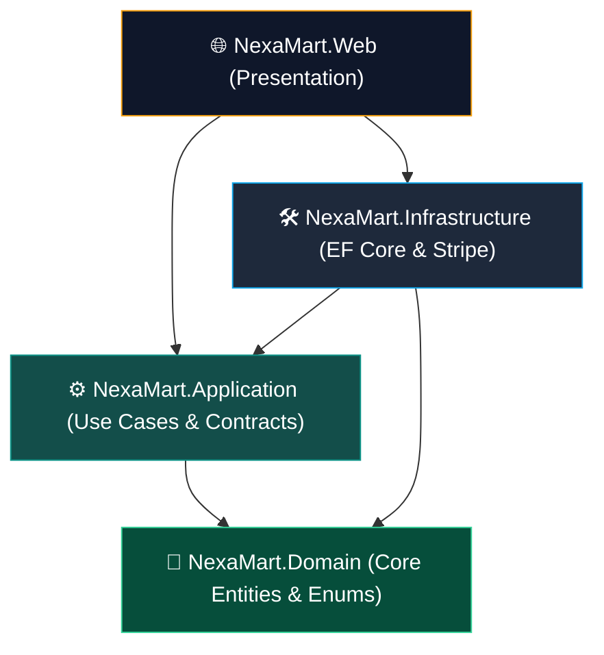
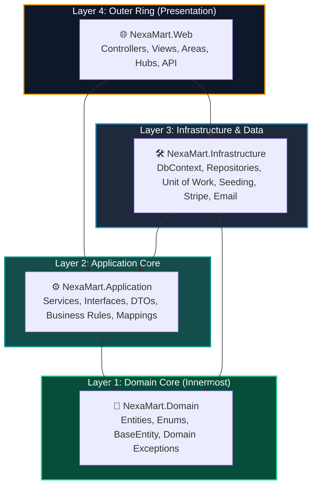
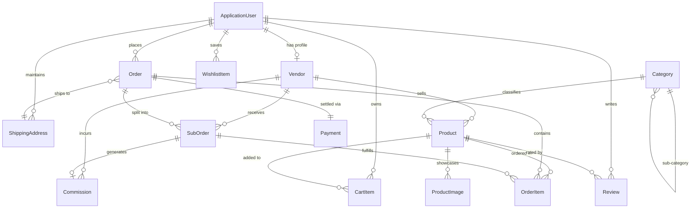

# 🧅 NexaMart — المرجع المعماري الشامل (Onion Architecture Blueprint & AI Developer Guide)

> **المشروع:** NexaMart — Multi-Vendor E-Commerce Marketplace Platform  
> **البيئة التقنية:** .NET 8.0 | ASP.NET Core MVC + Web API | Entity Framework Core 8 | SQL Server | ASP.NET Core Identity | SignalR | Stripe  
> **نمط المعمارية:** Onion Architecture (Clean Architecture)  
> **ملف الحل:** `NexaMart.sln`  
> **الغرض من هذا الملف:** دليل معماري وتقني شامل ومباشر لأي مطور أو نموذج ذكاء اصطناعي (AI Agent) للبدء في تنفيذ أي ميزة داخل المشروع دون الإخلال بمبادئ المعمارية أو الهوية البصرية.

---



## 📌 الفهرس العام

1. [مبادئ معمارية Onion Architecture في NexaMart](#1-مبادئ-معمارية-onion-architecture-في-nexamart)
2. [هيكلية الحل والمشاريع (Solution & Projects Structure)](#2-هيكلية-الحل-والمشاريع-solution--projects-structure)
3. [التفصيل الدقيق لكل طبقة (Deep Dive Layer-by-Layer)](#3-التفصيل-الدقيق-لكل-طبقة-deep-dive-layer-by-layer)
   - [3.1 طبقة النواة — NexaMart.Domain](#31-طبقة-النواة--nexamartdomain)
   - [3.2 طبقة التطبيق — NexaMart.Application](#32-طبقة-التطبيق--nexamartapplication)
   - [3.3 طبقة البنية التحتية — NexaMart.Infrastructure](#33-طبقة-البنية-التحتية--nexamartinfrastructure)
   - [3.4 طبقة العرض — NexaMart.Web](#34-طبقة-العرض--nexamartweb)
4. [مخطط العلاقات وقاعدة البيانات (ERD & Database Schema)](#4-مخطط-العلاقات-وقاعدة-البيانات-erd--database-schema)
5. [خوارزميات ومنطق الأعمال الأساسي (Core Business Workflows)](#5-خوارزميات-ومنطق-الأعمال-الأساسي-core-business-workflows)
   - [أ. تقسيم الطلب حسب البائع (Multi-Vendor Order Splitting)](#أ-تقسيم-الطلب-حسب-البائع-multi-vendor-order-splitting)
   - [ب. محرك حساب العمولات (Commission Engine)](#ب-محرك-حساب-العمولات-commission-engine)
   - [ج. دورة الدفع عبر Stripe و Webhooks](#ج-دورة-الدفع-عبر-stripe-و-webhooks)
   - [د. الإشعارات اللحظية عبر SignalR](#د-الإشعارات-اللحظية-عبر-signalr)
6. [الهوية البصرية ومعايير الواجهات (Brand Identity & UI Standards)](#6-الهوية-البصرية-ومعايير-الواجهات-brand-identity--ui-standards)
7. [دليل وقواعد الذكاء الاصطناعي لكتابة الكود (AI Coding Guidelines)](#7-دليل-وقواعد-الذكاء-الاصطناعي-لكتابة-الكود-ai-coding-guidelines)

---

## 1. مبادئ معمارية Onion Architecture في NexaMart

تعتمد منصة **NexaMart** نمط **Onion Architecture** المتمركز حول الدومين (Domain-Centric). المبدأ الجوهري الصارم هو:
> **اتجاه التبعيات دائماً نحو الداخل (Inward Dependencies Only)**  
> الطبقات الداخلية لا تعرف أي شيء عن الطبقات الخارجية.



### جدول قواعد التبعيات الصارمة (Dependency Rules)

| المشروع | نوع المشروع في .NET | المراجع المسموح بها (Allowed References) | المراجع الممنوعة قطعاً (FORBIDDEN) |
|:---|:---|:---|:---|
| **`NexaMart.Domain`** | Class Library | **لا يوجد أي مشروع آخر نهائياً** | يمنع الرجوع لـ `Application`, `Infrastructure`, `Web` أو استدعاء EF Core |
| **`NexaMart.Application`** | Class Library | `NexaMart.Domain` فقط | يمنع الرجوع لـ `Infrastructure` أو `Web` أو استدعاء SQL Server مباشرة |
| **`NexaMart.Infrastructure`** | Class Library | `NexaMart.Application` + `NexaMart.Domain` | يمنع الرجوع لـ `NexaMart.Web` |
| **`NexaMart.Web`** | Web App (MVC) | `NexaMart.Application` + `NexaMart.Infrastructure` | يمنع تجاوز `Application` والوصول لقاعدة البيانات مباشرة من الـ Controllers |

---

## 2. هيكلية الحل والمشاريع (Solution & Projects Structure)

```
NexaMart/
│
├── NexaMart.sln                                # حل المشروع الموحد
├── NexaMart.md                                 # توثيق المشروع والمهارات
├── ONION_ARCHITECTURE.md                       # هذا الملف (دليل المعمارية والمرجع للـ AI)
│
├── NexaMart.Domain/                            # الطبقة الأولى: النواة (Core Domain)
│   ├── Common/
│   │   └── BaseEntity.cs                       # Id, CreatedAt, UpdatedAt
│   ├── Enums/
│   │   ├── OrderStatus.cs
│   │   ├── VendorStatus.cs
│   │   ├── PaymentStatus.cs
│   │   ├── NotificationType.cs
│   │   └── CommissionStatus.cs
│   ├── Entities/
│   │   ├── ApplicationUser.cs                  # IdentityUser
│   │   ├── Vendor.cs                           # بيانات متجر البائع
│   │   ├── VendorApplication.cs                # طلبات الانضمام
│   │   ├── Category.cs                         # الأقسام
│   │   ├── Product.cs                          # المنتجات
│   │   ├── ProductImage.cs                     # معرض صور المنتج
│   │   ├── CartItem.cs                         # سلة التسوق
│   │   ├── Order.cs                            # الطلب الرئيسي
│   │   ├── OrderItem.cs                        # منتجات الطلب
│   │   ├── SubOrder.cs                         # الطلب المقسم لكل بائع
│   │   ├── Payment.cs                          # سجلات الدفع
│   │   ├── Review.cs                           # المراجعات والتقييمات
│   │   ├── WishlistItem.cs                     # قائمة المفضلة
│   │   ├── Commission.cs                       # عمولات المنصة
│   │   ├── Notification.cs                     # الإشعارات
│   │   └── ShippingAddress.cs                  # عناوين الشحن
│   └── NexaMart.Domain.csproj
│
├── NexaMart.Application/                       # الطبقة الثانية: منطق الأعمال والعقود (Application Core)
│   ├── Interfaces/
│   │   ├── Repositories/
│   │   │   ├── IGenericRepository.cs
│   │   │   └── IUnitOfWork.cs
│   │   └── Services/
│   │       ├── IProductService.cs
│   │       ├── ICategoryService.cs
│   │       ├── IVendorService.cs
│   │       ├── ICartService.cs
│   │       ├── IOrderService.cs
│   │       ├── IPaymentService.cs
│   │       ├── IReviewService.cs
│   │       ├── IWishlistService.cs
│   │       ├── ICommissionService.cs
│   │       ├── INotificationService.cs
│   │       ├── IFileStorageService.cs
│   │       └── IEmailService.cs
│   ├── DTOs/
│   │   ├── Products/                           # ProductDto, CreateProductDto, FilterDto
│   │   ├── Orders/                             # CreateOrderDto, SubOrderDto, OrderSummaryDto
│   │   ├── Cart/                               # CartDto, CartItemDto, AddToCartDto
│   │   ├── Vendors/                            # VendorDto, VendorProfileDto, VendorDashboardDto
│   │   ├── Categories/                         # CategoryDto
│   │   ├── Reviews/                            # ReviewDto, CreateReviewDto
│   │   └── Common/                             # PagedResultDto<T>, DashboardChartDto
│   ├── Services/                               # Business Logic Services Implementation
│   │   ├── ProductService.cs
│   │   ├── CartService.cs
│   │   ├── OrderService.cs
│   │   ├── VendorService.cs
│   │   ├── CategoryService.cs
│   │   └── CommissionService.cs
│   ├── Mapping/                                # DTO <-> Entity Mappings
│   │   └── MappingExtensions.cs
│   └── NexaMart.Application.csproj
│
├── NexaMart.Infrastructure/                    # الطبقة الثالثة: البنية التحتية وقاعدة البيانات (Infrastructure)
│   ├── Data/
│   │   ├── Context/
│   │   │   └── NexaMartDbContext.cs            # IdentityDbContext<ApplicationUser>
│   │   ├── Configurations/                     # Fluent API Entity Configurations
│   │   │   ├── ProductConfiguration.cs
│   │   │   ├── OrderConfiguration.cs
│   │   │   ├── SubOrderConfiguration.cs
│   │   │   ├── VendorConfiguration.cs
│   │   │   └── CategoryConfiguration.cs
│   │   └── Migrations/                         # EF Core Migrations
│   ├── Repositories/
│   │   ├── GenericRepository.cs
│   │   └── UnitOfWork.cs
│   ├── Seeding/
│   │   └── DbInitializer.cs                    # بيانات أولية غنية للاختبار
│   ├── Services/                               # External Implementations
│   │   ├── StripePaymentService.cs             # Stripe API + Webhooks
│   │   ├── LocalFileStorageService.cs          # حفظ الصور في wwwroot/uploads
│   │   └── SmtpEmailService.cs                 # إرسال البريد الإلكتروني
│   ├── Extensions/
│   │   └── ServiceCollectionExtensions.cs     # AddInfrastructureServices(...)
│   └── NexaMart.Infrastructure.csproj
│
└── NexaMart.Web/                               # الطبقة الرابعة: واجهة العرض (Presentation Layer)
    ├── Controllers/                            # Storefront Controllers
    │   ├── HomeController.cs
    │   ├── ProductController.cs
    │   ├── CategoryController.cs
    │   ├── CartController.cs
    │   ├── CheckoutController.cs
    │   ├── OrderController.cs
    │   ├── VendorStoreController.cs
    │   └── AccountController.cs
    ├── Areas/
    │   ├── Vendor/                             # لوحة تحكم البائع
    │   │   ├── Controllers/ (Dashboard, Products, Orders, Settings)
    │   │   └── Views/
    │   └── Admin/                              # لوحة تحكم Super Admin
    │       ├── Controllers/ (Dashboard, Vendors, Products, Orders, Categories, Reports)
    │       └── Views/
    ├── ApiControllers/                         # RESTful Endpoints (AJAX & Webhooks)
    │   ├── CartApiController.cs
    │   ├── WishlistApiController.cs
    │   ├── ReviewApiController.cs
    │   ├── NotificationApiController.cs
    │   └── StripeWebhookController.cs
    ├── Hubs/                                   # Real-Time SignalR
    │   ├── OrderHub.cs
    │   └── NotificationHub.cs
    ├── ViewModels/                             # View-Specific Models
    ├── ViewComponents/                         # CartIcon, NotificationsBell, VendorBadge
    ├── Views/
    │   ├── Shared/
    │   │   ├── _Layout.cshtml                  # الماستر العام بهوية NexaMart
    │   │   ├── _VendorLayout.cshtml
    │   │   └── _AdminLayout.cshtml
    │   └── Home/
    │       └── Index.cshtml                    # الصفحة الرئيسية المتكاملة
    ├── wwwroot/
    │   ├── css/
    │   │   └── site.css                        # Design Tokens, Dark Theme, Emerald/Teal
    │   ├── images/
    │   │   └── logo.jpg                        # اللوجو الرسمي لـ NexaMart
    │   ├── js/
    │   └── uploads/                            # مجلد رفع صور المنتجات والمتاجر
    ├── appsettings.json                        # Connection String & Settings
    ├── Program.cs                              # Composition Root & DI Setup
    └── NexaMart.Web.csproj
```

---

## 3. التفصيل الدقيق لكل طبقة (Deep Dive Layer-by-Layer)

### 3.1 طبقة النواة — `NexaMart.Domain`

#### الدور والمسؤولية
تمثل قلب المنصة. تحتوي على كافة المفاهيم المؤسسية (Business Entities) والـ Enums. لا تعتمد على أي مكتبة خارجية تخص قواعد البيانات أو الشبكة.

#### المكونات الأساسية
1. **`BaseEntity`**: الصنف الأساسي لكل الكيانات ويحتوي على:
   ```csharp
   public abstract class BaseEntity
   {
       public int Id { get; set; }
       public DateTime CreatedAt { get; set; } = DateTime.UtcNow;
       public DateTime? UpdatedAt { get; set; }
   }
   ```
2. **الكيانات المركزية (Core Entities)**:
   - **`ApplicationUser`**: يرث من `IdentityUser`، يحتوي على `FullName`, `AvatarUrl`, وعلاقات الربط بالسلة، الطلبات، التقييمات، وعناوين الشحن.
   - **`Vendor`**: يحتوي على بيانات المتجر (`StoreName`, `StoreDescription`, `LogoUrl`, `BannerUrl`, `CommissionRate`, `AverageRating`, `TotalSales`, `Status`).
   - **`Product` & `ProductImage`**: بيانات المنتج، السعر الأصلي والسعر الحالي، المخزون، الـ SKU، الـ CategoryId، والـ VendorId مع دعم صور متعددة للمنتج الواحد.
   - **`Order`, `OrderItem`, `SubOrder`**: نظام الطلبات المتقدم الذي يدعم تجزئة الطلب تلقائياً على عدة بائعين.
   - **`Commission`**: سجل العمولات المحسوبة لكل عملية بيع لصالح مالك المنصة.
   - **`Payment`**: بيانات عمليات الدفع وسجلات Stripe Session و PaymentIntent.
   - **`CartItem`, `WishlistItem`, `Review`, `Notification`, `ShippingAddress`**.
3. **الـ Enums**:
   - `OrderStatus`: `Pending`, `Confirmed`, `Processing`, `Shipped`, `Delivered`, `Cancelled`
   - `VendorStatus`: `Pending`, `Approved`, `Suspended`, `Rejected`
   - `PaymentStatus`: `Pending`, `Succeeded`, `Failed`, `Refunded`
   - `NotificationType`: `NewOrder`, `OrderUpdate`, `VendorApproved`, `NewReview`, `SystemAlert`
   - `CommissionStatus`: `Pending`, `Paid`, `Cancelled`

---

### 3.2 طبقة التطبيق — `NexaMart.Application`

#### الدور والمسؤولية
تحتوي على حالات الاستخدام (Use Cases)، ومنطق الأعمال التفاعلي، وواجهات التعامل (Contracts/Interfaces)، ونماذج نقل البيانات (DTOs).

#### واجهات المستودعات (Repository Contracts)
```csharp
public interface IGenericRepository<T> where T : BaseEntity
{
    Task<T?> GetByIdAsync(int id);
    Task<IReadOnlyList<T>> GetAllAsync();
    Task<IReadOnlyList<T>> GetAsync(Expression<Func<T, bool>> predicate);
    Task AddAsync(T entity);
    void Update(T entity);
    void Delete(T entity);
    Task<int> CountAsync(Expression<Func<T, bool>>? predicate = null);
}

public interface IUnitOfWork : IDisposable
{
    IGenericRepository<Product> Products { get; }
    IGenericRepository<Category> Categories { get; }
    IGenericRepository<Vendor> Vendors { get; }
    IGenericRepository<Order> Orders { get; }
    IGenericRepository<SubOrder> SubOrders { get; }
    IGenericRepository<CartItem> CartItems { get; }
    IGenericRepository<Commission> Commissions { get; }
    IGenericRepository<Review> Reviews { get; }
    Task<int> CompleteAsync(CancellationToken cancellationToken = default);
}
```

#### عقود الخدمات الرئيسية (Service Contracts)
- `IProductService`: جلب المنتجات مع الفلترة والترتيب والـ Pagination، إنشاء وتعديل المنتجات الخاصة بالبائع.
- `ICartService`: إدارة السلة، الحفظ في قاعدة البيانات للمستخدم المسجل، وتجميع السلة حسب البائع (`Grouped by Vendor`).
- `IOrderService`: إنشاء الطلب وتجزئته إلى `SubOrders` لكل بائع في Transaction واحدة، وتحديث حالات الطلبات.
- `ICommissionService`: حساب العمولة آلياً استناداً لنسبة البائع أو نسبة القسم وتوليد التقارير المالية.
- `IVendorService`: تسجيل البائع، فحص حالة الاعتماد، وجلب إحصائيات لوحة التحكم للبائع.

---

### 3.3 طبقة البنية التحتية — `NexaMart.Infrastructure`

#### الدور والمسؤولية
تجسيد الـ Interfaces عملياً عبر تقنيات الوصول للبيانات (Data Persistence) والخدمات الخارجية:
1. **`NexaMartDbContext`**:
   - يرث من `IdentityDbContext<ApplicationUser>`.
   - يضبط العلاقات وقيود الحذف (`OnDelete: Restrict`) لمنع حذف السجلات المالية أو الطلبات المرتبطة.
   - يضبط الدقة المالية لجميع الأسعار والعمولات: `.HasPrecision(18, 2)`.
2. **`UnitOfWork` و `GenericRepository<T>`**:
   - التعامل مع العمليات الشائعة والتأكد من إتمام التغييرات داخل Transaction موحدة.
3. **`DbInitializer` (بذر البيانات)**:
   - إنشاء الأدوار الثلاثة تلقائياً: `SuperAdmin`, `Vendor`, `Customer`.
   - بذر بائعين افتراضيين، أقسام رئيسية، ومنتجات تجريبية كاملة الصور والتقييمات.
4. **الخدمات الخارجية (External Integrations)**:
   - `StripePaymentService`: إنشاء `Stripe Checkout Session` والتعامل مع Webhooks.
   - `LocalFileStorageService`: فحص امتدادات الصور ورفعها في مسارات محددة تحت `wwwroot/uploads`.

---

### 3.4 طبقة العرض — `NexaMart.Web`

#### الدور والمسؤولية
نقطة الدخول الرئيسية للحل (Composition Root)، وتقديم الواجهات للمستخدم النهائي ولوحات التحكم.

#### تقسيم الـ Controllers
1. **Public Storefront Controllers**:
   - `HomeController`: الصفحة الرئيسية والبحث العام.
   - `ProductController`: تصفح المنتجات والفلترة المتقدمة.
   - `CartController` & `CheckoutController`: السلة والدفع.
   - `VendorStoreController`: صفحة متجر بائع معين للجمهور (`/Store/{slug}`).
2. **Areas**:
   - `Areas/Vendor`: وحدات تحكم مخصصة للبائع (`[Authorize(Roles = "Vendor")]`) لإدارة منتجاته، متابعة طلباته، وعرض أرباحه.
   - `Areas/Admin`: وحدات تحكم للمشرف العام (`[Authorize(Roles = "SuperAdmin")]`) لإدارة البائعين، اعتماد المنتجات، والتقارير المالية والعمولات.
3. **Web API & Webhooks**:
   - `CartApiController`: عمليات السلة الفورية بدون إعادة تحميل الصفحة (AJAX).
   - `StripeWebhookController`: استقبال إشعارات الدفع وتأكيد الطلبات تلقائياً (`[AllowAnonymous]`).
4. **SignalR Hubs**:
   - `OrderHub`: إشعار البائع لحظياً عند ورود طلب جديد، وتحديث المشتري فور تغيير حالة الطلب.

---

## 4. مخطط العلاقات وقاعدة البيانات (ERD & Database Schema)



---

## 5. خوارزميات ومنطق الأعمال الأساسي (Core Business Workflows)

### أ. تقسيم الطلب حسب البائع (Multi-Vendor Order Splitting)
عند إتمام الشراء (`Checkout`):
1. يتم إنشاء سجل `Order` عام يحتوي على إجمالي المبلغ وعنوان الشحن.
2. يتم تجميع المنتجات الموجودة في السلة حسب `VendorId` باستخدام `GroupBy`.
3. لكل بائع، يتم إنشاء `SubOrder` فرعي يحمل رقماً مميزاً (مثال: `NXM-20260001-V1`)، وتعيين المنتجات المرتبطة به.
4. يتم استدعاء محرك العمولات لحساب عمولة المنصة وصافي ربح البائع وحفظ سجل `Commission`.
5. يتم تفريغ سلة التسوق للمشتري.
6. يتم إرسال إشعار لحظي عبر SignalR لكل بائع وصله طلب جديد.
7. تنفذ جميع الخطوات السابقة داخل **Database Transaction** واحدة عبر `UnitOfWork` لضمان عدم حدوث أي تضارب.

### ب. محرك حساب العمولات (Commission Engine)
- يتم فحص نسبة العمولة المعرفة للبائع `Vendor.CommissionRate` (الافتراضية 10%).
- في حال وجود نسبة مخصصة للقسم `Category.CategoryCommissionRate`، تعطى الأولوية للنسبة المحددة.
- معادلة الحساب:
  $$\text{CommissionAmount} = \text{SubOrderTotal} \times \text{CommissionRate}$$
  $$\text{VendorPayout} = \text{SubOrderTotal} - \text{CommissionAmount}$$

---

## 6. الهوية البصرية ومعايير الواجهات (Brand Identity & UI Standards)

- **الاسم التجاري:** NexaMart
- **الشعار الرسمي (Slogan):** *"Where Vendors Meet Customers"* | *"سوقك، بائعينك، في مكان واحد"*
- **لوحة الألوان الأساسية:**
  - **Emerald (الرئيسي):** `#059669`
  - **Teal (تدرج وهوفر):** `#0D9488`
  - **Emerald Light (الشارات والعناصر النشطة):** `#34D399`
  - **Dark Backgrounds (الوضع الداكن المعتمد):**
    - الخلفية الأساسية: `#0A0F1E`
    - الكروت والـ Sidebar: `#111827`
    - الحقول والعناصر المحددة: `#1F2937`
    - الحدود والفواصل: `#374151`
  - **ألوان التمييز:** Amber (`#F59E0B`) للتقييمات، Orange (`#F97316`) للخصومات والعروض.
- **نظام الخطوط (Typography):**
  - العناوين (Headings): `'Outfit', sans-serif`
  - النصوص (Body): `'Inter', sans-serif`
  - الأسعار والأرقام والإحصائيات: `'JetBrains Mono', monospace`
- **شعار المنصة (Logo):** موجود ومدمج بمسار `NexaMart.Web/wwwroot/images/logo.jpg`.

---

## 7. دليل وقواعد الذكاء الاصطناعي لكتابة الكود (AI Coding Guidelines)

عندما يطلب منك المستخدم كتابة أو تعديل أي كود في مشروع NexaMart، التزم بالقواعد التالية بشكل قاطع:

1. **لا تخلط بين الطبقات نهائياً:**
   - لا تضع منطق قواعد بيانات أو EF Core داخل `NexaMart.Domain` أو `NexaMart.Application`.
   - لا تستدعِ الـ `DbContext` داخل أي Controller؛ تعامل دائماً عبر الـ Services المحقونة من `NexaMart.Application`.
2. **مكان وضع الملفات الجديدة:**
   - الكيانات (Entities) $\rightarrow$ `NexaMart.Domain/Entities/`
   - الـ Enums $\rightarrow$ `NexaMart.Domain/Enums/`
   - عقود الخدمات $\rightarrow$ `NexaMart.Application/Interfaces/Services/`
   - الـ DTOs $\rightarrow$ `NexaMart.Application/DTOs/{Feature}/`
   - تنفيذ الخدمات $\rightarrow$ `NexaMart.Application/Services/`
   - تكوينات EF Core $\rightarrow$ `NexaMart.Infrastructure/Data/Configurations/`
   - الـ Controllers $\rightarrow$ `NexaMart.Web/Controllers/` (أو داخل Area المناسبة)
3. **أفضل ممارسات الكود:**
   - استخدام الـ Async/Await في جميع عمليات قواعد البيانات مع تمرير `CancellationToken`.
   - استخدام الدقة `decimal(18,2)` لأي حقل مالي.
   - تفعيل الـ Nullable Reference Types والتأكد من خلو الكود من التحذيرات.
   - الحفاظ على التعليقات التوضيحية وتنسيق الأكواد بشكل احترافي.
