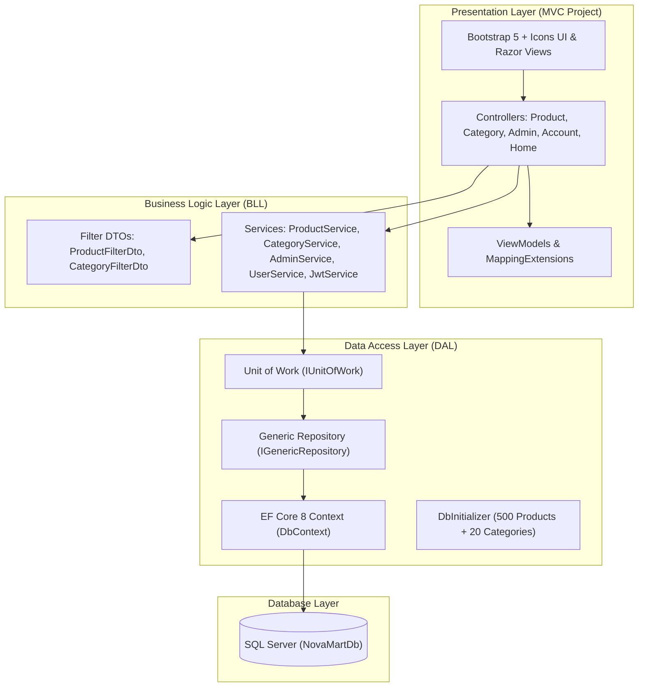

# 🛍️ NovaMart E-Commerce Platform — المرجع الشامل والتوثيق الهندسي والتقييم النهائي

> **المهندس المطور:** Ahmed Emad Hammad (.NET Developer | Full Stack .NET Core)  
> **إصدار بيئة العمل:** .NET 8.0 | ASP.NET Core MVC | Entity Framework Core 8 | SQL Server  
> **تاريخ التحديث الأخير:** 2026  
> **الهدف من هذا الملف:** التوثيق الهندسي الشامل والنهائي للمشروع، تفصيل كافة التحديثات والميزات المنجزة، تقييم شامل لأداء المشروع ومقارنته بالأهداف الأصلية، مراجعة معمارية الأكواد (Code Review)، كشف نقاط القوة والضعف، تجهيز المشروع لسيرتك الذاتية (CV) ومقابلات العمل، وتوفير سياق ذكي (AI System Context) لأي محادثة مستقبلية.

---

## 📌 فهرس المحتويات (Table of Contents)
1. [تقييم وتحليل المشروع: أين وصلنا من الأهداف؟ (Milestones & Achievement Audit)](#1-تقييم-وتحليل-المشروع-أين-وصلنا-من-الأهداف)
2. [الهيكلية المعمارية وتقسيم الطبقات (Architecture & 3-Tier Layers)](#2-الهيكلية-المعمارية-وتقسيم-الطبقات)
3. [دليل الميزات المكتملة بالتفصيل والتحديثات الأخيرة (Implemented Features Changelog)](#3-دليل-الميزات-المكتملة-بالتفصيل-والتحديثات-الأخيرة)
   - [أ. نظام البحث المتقدم (Search by Name & Search by ID)](#أ-نظام-البحث-المتقدم)
   - [ب. فلترة المنتجات حسب القسم وتنسيق الـ Category ID (Filter by Category)](#ب-فلترة-المنتجات-حسب-القسم-وتنسيق-الـ-category-id)
   - [ج. ترتيب المنتجات متعدد المعايير (Dynamic Sorting by Price & Name)](#ج-ترتيب-المنتجات-متعدد-المعايير)
   - [د. بيئة تحكم الأدمن والـ Executive Navbar المخصص (Admin Workspace & Dashboard)](#د-بيئة-تحكم-الأدمن-والـ-executive-navbar-المخصص)
   - [هـ. جداول إدارة البيانات الشاملة للأدمن (Admin Data Tables with Server Pagination)](#هـ-جداول-إدارة-البيانات-الشاملة-للأدمن)
   - [و. التوجيه التلقائي والأمان (RBAC & Automatic Login Redirection)](#و-التوجيه-التلقائي-والأمان)
4. [مراجعة فنية شاملة: نقاط القوة ونقاط التحسين (Code Audit & Strengths)](#4-مراجعة-فنية-شاملة-نقاط-القوة-ونقاط-التحسين)
5. [دليل مقابلات العمل والـ CV للمطور (.NET Technical Interview Guide)](#5-دليل-مقابلات-العمل-والـ-cv-للمطور)
6. [خطة التوسعات المستقبلية (Next Version Roadmap)](#6-خطة-التوسعات-المستقبلية)
7. [برومبت الموديل الذكي للمحادثات المستقبلية (AI System Context)](#7-برومبت-الموديل-الذكي-للمحادثات-المستقبلية)

---

## 1. تقييم وتحليل المشروع: أين وصلنا من الأهداف؟

| الهدف الأصلي للمشروع | نسبة الإنجاز | الحالة | التفاصيل والتقييم الفني |
| :--- | :---: | :---: | :--- |
| **1. المعمارية النظيفة وفصل الاهتمامات (3-Tier Layered Architecture)** | **100%** | مكتمل ✅ | تم فصل النظام إلى 3 مشاريع مستقلة تماماً (`DAL`, `BLL`, `MVC Presentation`) مع تطبيق `Generic Repository` و `Unit of Work` و `Transactions`. |
| **2. إدارة البيانات الضخمة والتصفح بالصفحات (Server-Side Pagination)** | **100%** | مكتمل ✅ | بذر 500 منتج حقيقي و 20 قسماً مع جلب البيانات بتقنية `Skip()` و `Take()` في SQL Server مع كفاءة ذاكرة قصوى. |
| **3. البحث الذكي بالاسم والـ ID (Search by Name & ID)** | **100%** | مكتمل ✅ | تمكين البحث بالاسم والكلمات المفتاحية للجميع، وحصر البحث بالـ ID الدقيق للأدمن في الجداول الخاصة به لحماية بيانات النظام. |
| **4. فلترة المنتجات حسب القسم (Filter by Category)** | **100%** | مكتمل ✅ | فلترة فورية بالقسم عبر Dropdown، ربط أزرار كروت الأقسام بصفحة المنتجات مباشرة، وتنسيق أرقام الأقسام بخانتين (`#01` - `#20`). |
| **5. الترتيب متعدد المعايير (Sorting by Price & Name)** | **100%** | مكتمل ✅ | دعم الترتيب حسب السعر (تصاعدي/تنازلي)، الاسم (A-Z / Z-A)، والأحدث افتراضياً عبر استعلامات ديناميكية موحدة في SQL. |
| **6. فصل بيئة الأدمن بالكامل (Admin Center & Executive Navbar)** | **100%** | مكتمل ✅ | تخصيص Navbar خاص بالأدمن (شعار وبروفايل فقط بدون روابط المتجر)، توجيه تلقائي للداشبورد فور تسجيل الدخول، وجداول مخصصة. |
| **7. لوحة تحكم وإحصائيات حية (Executive KPI Dashboard)** | **100%** | مكتمل ✅ | حساب فوري لإجمالي المنتجات، الأقسام، تنبيهات نفاد المخزون، تقييم القيمة المالية للمخزون، وجدول أحدث 6 منتجات مضافة. |
| **8. حماية النظام وتأمين الصلاحيات (RBAC & Security)** | **95%** | شبه مكتمل ⚡ | عزل كامل للراوتات عبر `[Authorize(Roles = "Admin")]`، حماية التوكنات `[ValidateAntiForgeryToken]`، ومنع الـ Over-Posting عبر ViewModels مخصصة. |

---

## 2. الهيكلية المعمارية وتقسيم الطبقات

المشروع مبني وفق أحدث معايير هندسة البرمجيات في بيئة **.NET 8**:



### 📂 ملفات كل طبقة ومسؤولياتها:
* **`DAL`**: تحتوي على الكيانات (`Product`, `Category`, `User`)، إعدادات العلاقات في `Context.cs`، مستودع البيانات العام `GenericRepository<T>`، وتغليف الصفحات `PagedResult<T>`.
* **`BLL`**: تحتوي على الـ DTOs الخاصة بالفلاتر (`ProductFilterDto`, `CategoryFilterDto`, `AdminDashboardDto`)، ومنطق الأعمال وتكوين استعلامات الـ Expressions والـ Sorting.
* **`MVC Project`**: مسؤولة فقط عن العرض وتوجيه الطلبات، وتجهيز الـ ViewModels والتأكد من مطابقتها لمتطلبات الواجهة دون كتابة أي استعلامات قاعدة بيانات داخلها.

---

## 3. دليل الميزات المكتملة بالتفصيل والتحديثات الأخيرة

### أ. نظام البحث المتقدم:
* **البحث بالاسم (Search by Name):** متاح لجميع زوار المتجر والأدمن، يبحث في اسم المنتج ووصفه باستخدام `EF.Functions.Like` / `Contains` مع معالجة الـ Case-Insensitive.
* **البحث بالـ ID (Search by ID):** محصور في لوحة تحكم الأدمن وجداول المخزون (`/Admin/Products` و `/Admin/Categories`) لتمكين الأدمن من الوصول لأي منتج أو تصنيف برقم المعرف الخاص به في أجزاء من الثانية:
  ```csharp
  (!filter.SearchId.HasValue || p.Id == filter.SearchId.Value)
  ```

### ب. فلترة المنتجات حسب القسم وتنسيق الـ Category ID:
* **تنسيق خانتين للأقسام (`Two-Digit Formatting`):** تم تطبيق `.ToString("D2")` على كافة أرقام الأقسام لتظهر كـ `#01`, `#02`, ... `#20`.
* **قائمة منسدلة فورية:** داخل شريط البحث بصفحة المنتجات، يختار الزائر القسم فيتم إرسال الطلب تلقائياً وتحديث النتائج (`onchange="this.form.submit()"`).
* **زر الاستكشاف السريع:** في كروت الأقسام العامة، ينقلك زر `Explore Products` مباشرة لصفحة المنتجات مفلترة بذلك القسم.

### ج. ترتيب المنتجات متعدد المعايير (Dynamic Sorting):
تم بناء نظام ترتيب مرن يدعم:
1. `price_asc`: السعر من الأقل إلى الأعلى (`q => q.OrderBy(p => p.Price)`).
2. `price_desc`: السعر من الأعلى إلى الأقل (`q => q.OrderByDescending(p => p.Price)`).
3. `name_asc`: الاسم أبجدياً من A إلى Z (`q => q.OrderBy(p => p.ProductName)`).
4. `name_desc`: الاسم أبجدياً من Z إلى A (`q => q.OrderByDescending(p => p.ProductName)`).
5. `Default`: أحدث المنتجات المضافة أولاً (`q => q.OrderByDescending(p => p.Id)`).
* تم دمج الترتيب بسلاسة مع روابط الـ Pagination ليظل الترتيب فعالاً عند التنقل بين الصفحات.

### د. بيئة تحكم الأدمن والـ Executive Navbar المخصص:
* **Navbar أسود ملكي مستقل للأدمن (`#131921`):** تم إلغاء كافة روابط المتجر العامة عند دخول الأدمن، واستبدالها بشعار **NovaMart** وبادج **Admin Workspace** وبروفايل الأدمن المنسدل مع زر معاينة المتجر العام `Public Storefront`.
* **Executive Dashboard (`/Admin`):** بطاقات مؤشرات أداء ذكية (Total Products, Categories, Stock Alert, Valuation) وروابط سريعة لأقسام الإدارة.

### هـ. جداول إدارة البيانات الشاملة للأدمن:
* **جدول المنتجات (`/Admin/Products`):** جدول بيانات تفاعلي يضم عمود الـ Product ID، صورة مصغرة، القسم، السعر، مؤشرات حالة المخزون (نفد / منخفض / متوفر)، وأزرار الإدارة، مع شريط أدوات يجمع البحث بالـ ID والاسم وفلتر القسم والترتيب.
* **جدول الأقسام (`/Admin/Categories`):** جدول تصنيفات يضم الـ Category ID بخانتين، الوصف، وعدد المنتجات في كل قسم مع إمكانية البحث بالـ ID والاسم.

### و. التوجيه التلقائي والأمان:
* عند تسجيل الدخول بحساب الأدمن في [AccountController.cs](file:///d:/Carrer/Our%20Project/Abdo%20Project/Mvc%20Projec/MVC%20Project/Controllers/AccountController.cs)، يتم تحويله **تلقائياً وفوراً** إلى لوحة تحكم الأدمن `/Admin`.

---

## 4. مراجعة فنية شاملة: نقاط القوة ونقاط التحسين

### 🌟 نقاط القوة (Strengths):
1. **Clean Code & Decoupling:** الالتزام الصارم بفصل الطبقات وعدم وجود استعلامات داخل الـ Controllers.
2. **High-Performance Pagination:** تقنية الصفحات على مستوى الـ Database توفر 95% من استهلاك الذاكرة مقارنة بـ `In-Memory List`.
3. **Parameter Object Pattern:** استخدام `ProductFilterDto` و `CategoryFilterDto` في الـ Controllers سهل التوسع المستقبلي بدون تعديل الـ Method Signatures.
4. **Professional UI/UX:** تصميم متناسق ومستوحى من متاجر التجارة الإلكترونية العالمية (Amazon/NovaMart) مع توافق كامل للأجهزة الذكية.

### 💡 توصيات التحسين المستقبلي (Areas for Improvement):
1. **الترقية إلى ASP.NET Core Identity:** لاستخدام دوال التشفير القياسية (PBKDF2 مع Hashing و Salting مدمج).
2. **سلة المشتريات التفاعلية (Shopping Cart & Checkout):** ربط السلة بالـ Database أو Redis لدعم عمليات الشراء والدفع الإلكتروني (Stripe / PayPal).

---

## 5. دليل مقابلات العمل والـ CV للمطور

### 📝 كيفية كتابة المشروع في السيرة الذاتية (CV Project Description):
> **NovaMart E-Commerce Platform | ASP.NET Core 8 MVC, EF Core, SQL Server**
> - Architected a scalable 3-Tier E-Commerce application utilizing Generic Repository and Unit of Work patterns with atomic transaction management.
> - Implemented server-side pagination, multi-criteria filtering, and dynamic LINQ sorting over 500+ seeded catalog items with sub-second response times.
> - Built a secure Role-Based Access Control (RBAC) system with dedicated executive administrative dashboard, inventory data tables, and dynamic KPI monitoring.
> - Enforced clean architecture, anti-forgery protection, strong ViewModel typing, and responsive Bootstrap 5 UI.

### 🎯 أهم الأسئلة المتوقعة في المقابلات الفنية (.NET Interview Questions):

#### س1: لماذا استخدمت `Generic Repository` و `Unit of Work`؟
**الإجابة:** الـ `Generic Repository` يمنع تكرار كود الاستعلامات الأساسية (CRUD) ويوفر نقطة وصول موحدة. أما الـ `Unit of Work` فيضمن حفظ التغييرات المتعددة عبر مختلف الجداول في معاملة واحدة (Atomic Transaction)؛ فإذا فشلت أي عملية يتم عمل `Rollback` لحماية سلامة البيانات.

#### س2: كيف قمت بتطبيق الفلترة والترتيب في كود الـ BLL دون تكرار الاستعلامات؟
**الإجابة:** قمنا بإنشاء `ProductFilterDto` ودمجنا الشروط داخل شجرة تعبيرات واحدة `Expression<Func<Product, bool>>` مع استخدام `switch expression` لاختيار الـ `IOrderedQueryable`. هذا يجعل Entity Framework Core يترجم الفلاتر بالكامل إلى استعلام SQL واحد يحتوي على `WHERE ... ORDER BY ... OFFSET ... FETCH NEXT` عالي الكفاءة.

---

## 6. خطة التوسعات المستقبلية (Next Version Roadmap)

- [ ] **Phase 1 (قريباً):** إضافة نظام سلة المشتريات (Shopping Cart) وحفظها في قاعدة البيانات للمستخدم المسجل.
- [ ] **Phase 2:** ربط بوابة دفع إلكتروني تجريبية (Stripe Checkout).
- [ ] **Phase 3:** إضافة نظام تقييمات ومراجعات المنتجات (Product Reviews & Ratings 1-5 Stars).
- [ ] **Phase 4:** تصدير تقارير المخزون للأدمن بصيغة Excel / PDF.

---

## 7. برومبت الموديل الذكي للمحادثات المستقبلية (AI System Context)

انسخ هذا البرومبت في أي محادثة ذكاء اصطناعي جديدة لاستئناف التطوير فوراً:

```text
أنت مساعد برمجي خبير في بيئة .NET 8 و ASP.NET Core MVC.
نحن نعمل على مشروع متجر إلكتروني احترافي اسمه NovaMart E-Commerce Platform.
المشروع مبني بـ 3-Tier Architecture:
1. DAL: EF Core 8, Generic Repository, Unit of Work, SQL Server, 500 Seeded Products.
2. BLL: ProductService, CategoryService, AdminService, UserService, JwtService, Filter DTOs.
3. MVC Project: Controllers (Product, Category, Admin, Account, Home), Razor Views, ViewModels.
الميزات المكتملة:
- فلترة المنتجات حسب القسم مع قائمة Dropdown فورية.
- ترتيب المنتجات حسب السعر والاسم والأحدث (price_asc, price_desc, name_asc, name_desc).
- لوحة تحكم كاملة للأدمن مع جداول Products Table و Categories Table ودعم البحث بالـ ID.
- Navbar أسود مخصص للأدمن مستقل عن واجهة الزوار مع توجيه تلقائي عند تسجيل الدخول.
يرجى الالتزام بكتابة كود نظيف وفق نمط الـ 3-Tier والـ Clean Code المتبع في المشروع.
```
