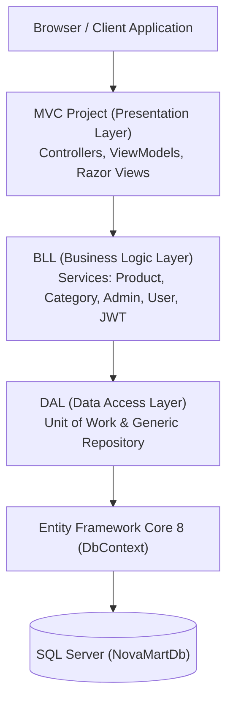

# 🛒 NovaMart E-Commerce Platform — Enterprise .NET 8 MVC

[](https://dotnet.microsoft.com/)
[](https://docs.microsoft.com/ef/core/)
[]()
[]()
[]()

A full-stack, enterprise-grade E-Commerce web platform developed using **ASP.NET Core 8 MVC**, **Entity Framework Core**, and **SQL Server**. The solution is built with a decoupled **3-Tier Layered Architecture** (DAL, BLL, Presentation) enforcing SOLID principles, clean code practices, server-side data pagination over 500+ seeded catalog items, dynamic multi-criteria sorting and filtering, and a dedicated executive administrative workspace.

Developed by: **[Ahmed Emad Hammad](https://github.com/)** (.NET Developer | Full Stack .NET Core)

---

## 📑 Detailed Engineering Documentation (التوثيق الشامل)
> 💡 للتوثيق الفني الشامل، مراجعة الأكواد، التقييم النهائي للمشروع، وأسئلة مقابلات العمل، يرجى مراجعة الملف الأساسي:  
> **👉 [PROJECT_MASTER_DOCUMENTATION.md](./PROJECT_MASTER_DOCUMENTATION.md)**

---

## 🏛️ System Architecture



---

## 🚀 Key Features & Implemented Capabilities

### 1. Decoupled 3-Tier Layered Architecture:
* **`DAL (Data Access Layer)`**: Domain models (`Product`, `Category`, `User`), Generic Repository (`IGenericRepository<T>`), Unit of Work with transaction management, and automatic database seeder (`DbInitializer.cs`) preloading 20 categories and 500 catalog items.
* **`BLL (Business Logic Layer)`**: Business services, dynamic predicate expression builders, and unified Parameter Objects (`ProductFilterDto`, `CategoryFilterDto`, `AdminDashboardDto`).
* **`Presentation Layer (MVC)`**: Razor views styled with Bootstrap 5 and modern dark theme, strongly-typed ViewModels, and zero SQL queries in controllers.

### 2. High-Performance Catalog Search, Filter & Sort:
* **Instant Category Filtering**: Dropdown filtering with automatic form submission (`onchange="this.form.submit()"`).
* **Two-Digit Category Formatting**: Standardized `#01`, `#02`... `#20` IDs across all views.
* **Multi-Criteria Dynamic Sorting**:
  - `Price: Low to High ↑` (`price_asc`)
  - `Price: High to Low ↓` (`price_desc`)
  - `Name: A to Z` (`name_asc`)
  - `Name: Z to A` (`name_desc`)
  - `Default: Newest Arrivals` (`Id DESC`)
* **Server-Side Pagination**: Efficient `Skip()` and `Take()` queries maintaining active filters across pages.

### 3. Dedicated Executive Admin Workspace:
* **Minimalist Admin Navbar**: Dark Amazon Navy navbar featuring only the NovaMart Brand Logo, Admin Badge, and Admin Profile menu (clean, distraction-free environment).
* **Automatic Login Redirection**: Admins are immediately routed to `/Admin` upon successful sign-in.
* **KPI Analytics Dashboard**: Real-time metrics for Total Products, Categories, Out of Stock alerts, and Total Inventory Gross Valuation.
* **Administrative Inventory Data Tables**:
  - **Products Table (`/Admin/Products`)**: Full table with Product ID badges (`#@product.Id`), image thumbnails, stock levels, ID Search, Category filter, and sorting.
  - **Categories Directory (`/Admin/Categories`)**: Full table with Category IDs (`#@cat.Id.ToString("D2")`), total item count badges, and ID Search.

### 4. Security & Role-Based Access Control (RBAC):
* Route protection via `[Authorize(Roles = "Admin")]`.
* Anti-Forgery Token validation on all form submissions (`[ValidateAntiForgeryToken]`).
* Over-posting prevention via separate DTOs and ViewModels.

---

## 💻 How to Run Locally

### 1. Prerequisites
- [.NET 8.0 SDK](https://dotnet.microsoft.com/download/dotnet/8.0)
- SQL Server (LocalDB, SQL Express, or standard SQL Server)

### 2. Configure Connection String
Open `MVC Project/appsettings.json` and adjust the connection string if needed:
```json
"ConnectionStrings": {
  "DefaultConnection": "Server=(localdb)\\mssqllocaldb;Database=NovaMartDb;Trusted_Connection=True;MultipleActiveResultSets=true"
}
```

### 3. Build & Run
Open terminal in the workspace root and execute:
```bash
dotnet build
dotnet run --project "MVC Project/MVC Project.csproj"
```
The application will automatically apply any pending EF Core migrations and seed 500 products and 20 categories upon startup.

---

## 📊 Project Milestone Evaluation

| Milestone / Feature | Status | Score |
| :--- | :---: | :---: |
| 3-Tier Layered Architecture & Design Patterns | Completed | 100% |
| Database Seeding & Server-Side Pagination | Completed | 100% |
| Search by Name & Search by ID (Admin Only) | Completed | 100% |
| Dynamic Category Filter & 2-Digit ID Formatting | Completed | 100% |
| Multi-Criteria Sorting (Price / Name / Newest) | Completed | 100% |
| Dedicated Admin Workspace & Executive Navbar | Completed | 100% |
| Executive KPI Dashboard & Management Data Tables | Completed | 100% |
| Automated Admin Login Routing & RBAC Security | Completed | 100% |

---

## 📬 Contact & Author
- **Ahmed Emad Hammad** (.NET Developer | Full Stack .NET Core)
- Email: ahmedemadhammmad@gmail.com
- Phone: (+20) 01121288818
- LinkedIn: [Ahmed Emad Hammad](https://www.linkedin.com/)
- GitHub: [Ahmed Emad Hammad](https://github.com/)
