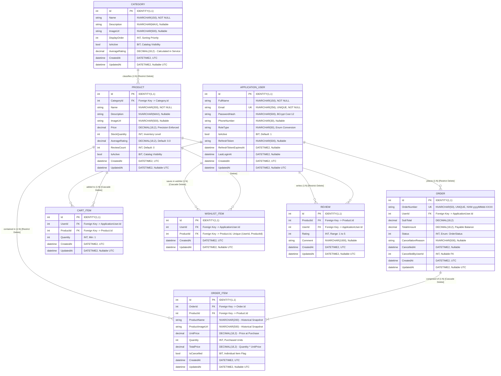
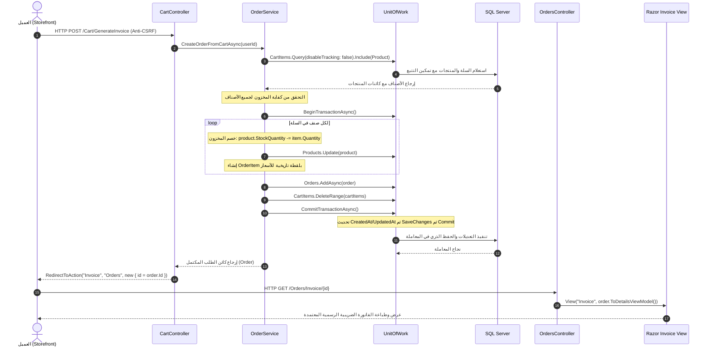
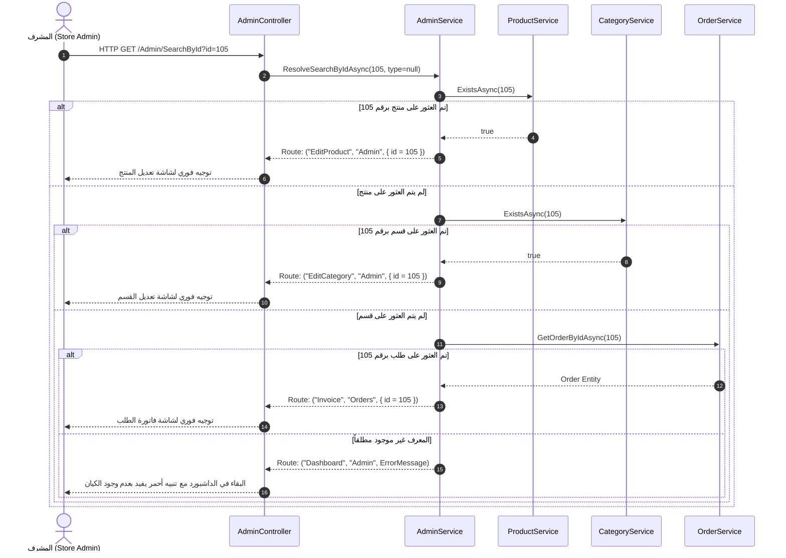

# 📘 الدليل الهندسي والمعماري الشامل لمشروع NexaMart Enterprise
## Comprehensive System Architecture, Database ERD, Code Anatomy & Reviewer Guide

> **موجّه لمراجع الكود، مهندسي البرمجيات، ولجان التقييم التقني (Technical Reviewers & Evaluators)**  
> تم إعداد هذا المرجع التوثيقي ليكون سجلاً شاملاً بنسبة 100% يغطي كافة التفاصيل المعمارية والبرمجية لمنصة **NexaMart** المبنية وفق معايير **Clean Architecture** ونمط **Domain-Driven Design (DDD)** باستخدام **ASP.NET Core 8.0 MVC** و **Entity Framework Core 8.0** على **SQL Server**.  
> يشرح هذا الملف تفصيلياً سطر بسطر: مخطط قاعدة البيانات والعلاقات، بنية الطبقات الأربع، المستودعات ووحدة العمل، كافة الخدمات الـ 11 ومنطق الأعمال، كائنات نقل البيانات (DTOs)، نماذج واجهة العرض (ViewModels)، طبقة التحويل المقسمة (Mappings)، منظومة الأمان ورفع الصور بفحص البايتات السحرية (Magic Bytes)، ومسارات تدفق البيانات مع سجل لكافة التحسينات المنجزة.

---

## 📑 فهرس المحتويات الشامل
1. [نظرة عامة على النظام وأهداف المنصة (Executive Overview)](#1-نظرة-عامة-على-النظام-وأهداف-المنصة-executive-overview)
2. [مخطط قاعدة البيانات الشامل وتفصيل العلاقات (Database ERD & Constraints)](#2-مخطط-قاعدة-البيانات-الشامل-وتفصيل-العلاقات-database-erd--constraints)
3. [الهندسة المعمارية للنظام وتصميم الطبقات (Clean Architecture Design)](#3-الهندسة-المعمارية-للنظام-وتصميم-الطبقات-clean-architecture-design)
4. [التشريح البرمجي لطبقة الـ Domain (Pure Domain POCOs & Enums)](#4-التشريح-البرمجي-لطبقة-الـ-domain-pure-domain-pocos--enums)
5. [التشريح البرمجي لطبقة الـ Infrastructure (EF Core, Repositories & Security)](#5-التشريح-البرمجي-لطبقة-الـ-infrastructure-ef-core-repositories--security)
6. [التشريح البرمجي لطبقة الـ Application (Services, DTOs & Business Rules)](#6-التشريح-البرمجي-لطبقة-الـ-application-services-dtos--business-rules)
7. [التشريح البرمجي لطبقة الـ Presentation Web (Controllers, Mappings & Views)](#7-التشريح-البرمجي-لطبقة-الـ-presentation-web-controllers-mappings--views)
8. [منظومة الأمان والحماية الشاملة (Enterprise Security & Defense-in-Depth)](#8-منظومة-الأمان-والحماية-الشاملة-enterprise-security--defense-in-depth)
9. [مخططات تسلسل تدفق البيانات (End-to-End Sequence Diagrams)](#9-مخططات-تسلسل-تدفق-البيانات-end-to-end-sequence-diagrams)
10. [سجل كافة الميزات والتحسينات المنجزة (Feature & Refactoring Ledger)](#10-سجل-كافة-الميزات-والتحسينات-المنجزة-feature--refactoring-ledger)
11. [دليل المراجع السريع للفحص والتشغيل (Reviewer Quick-Start & Testing Guide)](#11-دليل-المراجع-السريع-للفحص-والتشغيل-reviewer-quick-start--testing-guide)

---

## 1. نظرة عامة على النظام وأهداف المنصة (Executive Overview)

منصة **NexaMart** هي نظام تجارة إلكترونية وإدارة مؤسسية متكاملة (**Enterprise E-Commerce & Administrative Governance Platform**) يجمع بين تجربة تسوق تفاعلية للمستهلك ولوحات تحكم تنفيذية متعددة المستويات لإدارة العمليات والمخزون والحوكمة الأمنية.

```
                           ┌─────────────────────────────────────────────────────────┐
                           │                 NexaMart Enterprise System               │
                           └────────────────────────────┬────────────────────────────┘
                                                        │
         ┌──────────────────────────────────────────────┼─────────────────────────────────────────────┐
         ▼                                              ▼                                             ▼
┌─────────────────────────────────┐   ┌─────────────────────────────────────────┐   ┌─────────────────────────────────────────┐
│     Storefront Experience       │   │       Store Admin Command Center        │   │    Executive SuperAdmin Console         │
│  - Modern Product Browsing      │   │  - Dedicated Navbar-Free Layout         │   │  - Full System & Role Governance        │
│  - Dynamic Star Ratings         │   │  - Strict Data Tables (Zero Cards)      │   │  - Safe Promotion/Demotion Hierarchy    │
│  - Cart & Persistent Wishlist   │   │  - Universal Search by ID Engine        │   │  - Account Deactivation/Activation      │
│  - Instant Tax Invoice Checkout │   │  - In-Service Realtime Avg Rating       │   │  - User Spending & Order History Audit  │
│  - Complaint Ticket System      │   │  - Drag & Drop Secure Image Management  │   │  - Administrator Account Provisioning   │
└─────────────────────────────────┘   └─────────────────────────────────────────┘   └─────────────────────────────────────────┘
```

### ركائز النظام الأساسية ومجالات الاستخدام:
1. **متجر العملاء ([Storefront Portal](file:///d:/Carrer/Our%20Project/Abdo%20Project/NexaMart/NexaMart.Web/Controllers/HomeController.cs))**:
   - تصفح كتالوج المنتجات وتصنيفها مع دعم الترقيم المتقدم للبيانات من قاعدة البيانات مباشرة ([ProductsController](file:///d:/Carrer/Our%20Project/Abdo%20Project/NexaMart/NexaMart.Web/Controllers/ProductsController.cs)).
   - سلة تسوق ديناميكية وقائمة مفضلة دائمة مع التحقق الفوري من حدود المخزون.
   - **إصدار الفاتورة الضريبية الفورية المعتمدة ([Invoice Receipt](file:///d:/Carrer/Our%20Project/Abdo%20Project/NexaMart/NexaMart.Web/Controllers/OrdersController.cs))**: توليد فواتير رسمية معتمدة قابلة للطباعة تخصم المخزون ذرّياً في خطوة واحدة دون تعقيدات وهمية أو شاشات دفع صورية.
   - مركز تقديم الشكاوى والاستفسارات وتوليد تذاكر دعم فني مرقمة مع توجيه بريدي ([ContactUs](file:///d:/Carrer/Our%20Project/Abdo%20Project/NexaMart/NexaMart.Web/Controllers/HomeController.cs#L47-L69)).

2. **مركز قيادة إدارة المتجر ([Store Admin Command Portal](file:///d:/Carrer/Our%20Project/Abdo%20Project/NexaMart/NexaMart.Web/Controllers/AdminController.cs))**:
   - واجهة منعزلة تماماً تعتمد على تخطيط مخصص [\_AdminLayout.cshtml](file:///d:/Carrer/Our%20Project/Abdo%20Project/NexaMart/NexaMart.Web/Views/Shared/_AdminLayout.cshtml) **خالية تماماً من شريط تنقل المتجر العام (Storefront Navbar)** لضمان التركيز الإداري.
   - إدارة العمليات والكتالوج من خلال **جداول بيانات حصرية (Data Tables وليست كروت)** لتسهيل فرز ومتابعة كميات المخزون وحالات الطلبات.
   - محرك بحث ذكي فوري برقم الـ ID يكتشف نوع الكيان تلقائياً ويوجه المشرف لشاشته مباشرة.
   - رفع آمن للصور بتقنية السحب والإفلات (Drag & Drop) وفحص التوقيع الثنائي الحقيقي (Magic Bytes).

3. **لوحة الإدارة العليا وحوكمة المنصة ([Executive SuperAdmin Console](file:///d:/Carrer/Our%20Project/Abdo%20Project/NexaMart/NexaMart.Web/Controllers/SuperAdminController.cs))**:
   - حوكمة شاملة لكافة حسابات النظام وتوزيع الصلاحيات والرتب (`Customer`, `Admin`, `SuperAdmin`).
   - قواعد حماية أمنية ذاتية تمنع المشرف العام من حظر حسابه أو تنزيل رتبته الذاتية لتفادي قفل النظام العرضي.
   - مراجعة السجل المالي والإنفاق التاريخي لكل عميل وتعيين وتشفير حسابات المشرفين الجدد.

4. **بوابة تسجيل الدخول الموحدة ([Unified Authentication Gateway](file:///d:/Carrer/Our%20Project/Abdo%20Project/NexaMart/NexaMart.Web/Controllers/AccountController.cs))**:
   - مدخل تسجيل دخول ذكي واحد يستقبل **البريد الإلكتروني للعملاء** أو **الـ ID الرقمي للموظفين** مع توجيه تلقائي مباشر حسب الصلاحيات، مع فحص قوة كلمات المرور وحجب كلمات السر الشائعة.

---

## 2. مخطط قاعدة البيانات الشامل وتفصيل العلاقات (Database ERD & Constraints)

تم تصميم قاعدة البيانات بأسلوب **Code-First** عبر **Entity Framework Core 8.0** على **SQL Server**، مع فرض قيود صارمة على مستوى الـ Schema تضمن سلامة البيانات (Referential Integrity) وعدم فقدان السجلات التاريخية المالية.

### مخطط الكيانات والعلاقات (Comprehensive Database Diagram):



### القواعد الصارمة لسلامة البيانات والعلاقات (Referential Integrity):
1. **علاقة المستخدم بالطلبات ([ApplicationUser](file:///d:/Carrer/Our%20Project/Abdo%20Project/NexaMart/NexaMart.Domain/Entities/ApplicationUser.cs) &rarr; [Order](file:///d:/Carrer/Our%20Project/Abdo%20Project/NexaMart/NexaMart.Domain/Entities/Order.cs)) [1:N]**:
   - نوع الحذف: `DeleteBehavior.Restrict`. يمنع نهائياً حذف أي مستخدم لديه سجل طلبات في النظام، حفاظاً على الأثر المالي والتدقيقي (Financial Audit Trail).
2. **علاقة القسم بالمنتجات ([Category](file:///d:/Carrer/Our%20Project/Abdo%20Project/NexaMart/NexaMart.Domain/Entities/Category.cs) &rarr; [Product](file:///d:/Carrer/Our%20Project/Abdo%20Project/NexaMart/NexaMart.Domain/Entities/Product.cs)) [1:N]**:
   - نوع الحذف: `DeleteBehavior.Restrict`. تم ضبطها في [CategoryConfiguration.cs](file:///d:/Carrer/Our%20Project/Abdo%20Project/NexaMart/NexaMart.Infrastructure/Data/Configurations/CategoryConfiguration.cs) و [CategoryService.cs](file:///d:/Carrer/Our%20Project/Abdo%20Project/NexaMart/NexaMart.Application/Services/CategoryService.cs#L147-L165)؛ تمنع حذف أي قسم يحتوي على منتجات مرتبطة لحماية الكتالوج من المنتجات اليتيمة.
3. **علاقة بنود الطلب بالمنتج ([OrderItem](file:///d:/Carrer/Our%20Project/Abdo%20Project/NexaMart/NexaMart.Domain/Entities/OrderItem.cs) &rarr; [Product](file:///d:/Carrer/Our%20Project/Abdo%20Project/NexaMart/NexaMart.Domain/Entities/Product.cs)) [1:N]**:
   - نوع الحذف: `DeleteBehavior.Restrict`. لا يمكن حذف منتج تم شراؤه مسبقاً في طلبات مكتملة.
   - **نمط اللقطة التاريخية (Historical Snapshot Pattern)**: يتم نسخ `ProductName`, `ProductImageUrl`, و `UnitPrice` داخل جدول `OrderItem` وقت إصدار الفاتورة. هذا يضمن ثبات قيمة الفواتير السابقة قانونياً وتاريخياً حتى لو قام التاجر بتعديل سعر المنتج أو اسمه في الكتالوج مستقبلاً.
4. **علاقة الطلب ببنوده ([Order](file:///d:/Carrer/Our%20Project/Abdo%20Project/NexaMart/NexaMart.Domain/Entities/Order.cs) &rarr; [OrderItem](file:///d:/Carrer/Our%20Project/Abdo%20Project/NexaMart/NexaMart.Domain/Entities/OrderItem.cs)) [1:N]**:
   - نوع الحذف: `DeleteBehavior.Cascade`. بنود الطلب تابعة للطلب ككل.
5. **جداول السلة والمفضلة ([CartItem](file:///d:/Carrer/Our%20Project/Abdo%20Project/NexaMart/NexaMart.Domain/Entities/CartItem.cs), [WishlistItem](file:///d:/Carrer/Our%20Project/Abdo%20Project/NexaMart/NexaMart.Domain/Entities/WishlistItem.cs))**:
   - نوع الحذف: `DeleteBehavior.Cascade` عند حذف المستخدم أو حذف المنتج.
   - فهرس فريد مركب: `Unique Index on (UserId, ProductId)` على المفضلة لمنع تكرار نفس الصنف لنفس العميل.

---

## 3. الهندسة المعمارية للنظام وتصميم الطبقات (Clean Architecture Design)

يتبع النظام بدقة فلسفة **Clean Architecture** (المعمارية النظيفة)، حيث تتجه جميع التبعيات حصراً نحو الداخل باتجاه النواة (Inward Dependency Rule):

```
┌───────────────────────────────────────────────────────────────────────────────────┐
│                                  NexaMart.Web                                     │
│  - Presentation Layer: Controllers, Razor Views, Admin Layout, ViewModels         │
│  - Thin Orchestrators (1-5 lines per action)                                      │
│  - Modular Mappings: StorefrontMappings, AdminMappings, SuperAdminMappings        │
│  - Anti-XSS validation, Secure File Upload Handlers                               │
└────────────────────────────────────────┬──────────────────────────────────────────┘
                                         │ References
┌────────────────────────────────────────▼──────────────────────────────────────────┐
│                               NexaMart.Application                                │
│  - Core Business Rules, Validations & Workflows                                   │
│  - 11 Application Services & Interfaces (AdminService, OrderService, etc.)        │
│  - Data Transfer Objects (DTOs) & Common Pagination Filter Models                 │
│  - High Performance LINQ Aggregations (Single GroupBy Queries)                    │
│  - Clean Contracts: Repositories & Security Abstractions                          │
└──────────────────┬────────────────────────────────────────────────┬───────────────┘
                   │ References & Implements                        │ References
┌──────────────────▼───────────────────────────┐ ┌──────────────────▼───────────────┐
│            NexaMart.Infrastructure           │ │             NexaMart.Domain      │
│  - NexaMartDbContext & 8 Configurations      │ │  - Core Domain Entities (8)      │
│  - GenericRepository<T> & Streamlined UoW    │ │  - Business Enums                │
│  - BCrypt WorkFactor=12 Password Hashing     │ │  - Zero NuGet Dependencies       │
│  - Database Seeder (Accounts, Categories, 500)│ │  - Pure C# Objects (POCOs)       │
│  - Auto-Audit Timestamps via ChangeTracker   │ │                                  │
└──────────────────────────────────────────────┘ └──────────────────────────────────┘
```

### قواعد التبعيات وانضباط المعمارية:
1. **[NexaMart.Domain](file:///d:/Carrer/Our%20Project/Abdo%20Project/NexaMart/NexaMart.Domain/)**:
   - لا تعتمد على أي طبقة أخرى ولا على أي مكتبة خارجية (Zero 3rd-party Dependencies). نقية 100%.
2. **[NexaMart.Application](file:///d:/Carrer/Our%20Project/Abdo%20Project/NexaMart/NexaMart.Application/)**:
   - تعتمد فقط على الـ Domain. تعرّف الواجهات (Interfaces) ونماذج البيانات (DTOs) ومنطق الأعمال والحسابات الإحصائية المجمعة.
3. **[NexaMart.Infrastructure](file:///d:/Carrer/Our%20Project/Abdo%20Project/NexaMart/NexaMart.Infrastructure/)**:
   - تعتمد على Application و Domain، وتنفذ الاتصال بالـ SQL Server وتوفر التشفير وخدمات التوكن وإدارة المعاملات وحفظ التغييرات.
4. **[NexaMart.Web](file:///d:/Carrer/Our%20Project/Abdo%20Project/NexaMart/NexaMart.Web/)**:
   - نقطة دخول النظام (Host)، تعتمد على Application و Infrastructure للتسجيل في حاوية الـ DI، وتستهلك الخدمات عبر الـ Controllers المجرّدة دون التعامل المباشر مع جداول قاعدة البيانات.

---

## 4. التشريح البرمجي لطبقة الـ Domain (Pure Domain POCOs & Enums)

تحتوي هذه الطبقة على الكيانات المركزية للنظام ممثلة كـ POCOs نقية تماماً دون أي ارتباط بأي إطار عمل:

### 1. الكيانات الأساسية (Entities):
- **[ApplicationUser.cs](file:///d:/Carrer/Our%20Project/Abdo%20Project/NexaMart/NexaMart.Domain/Entities/ApplicationUser.cs)**:
  - يحمل هوية المستخدم، بريده الإلكتروني، التشفير بـ BCrypt، رقم الهاتف، رتبته `RoleType` ([UserRoleType](file:///d:/Carrer/Our%20Project/Abdo%20Project/NexaMart/NexaMart.Domain/Enums/UserRoleType.cs))، حالة التفعيل `IsActive`، حقول الـ JWT Refresh Token، وتوقيت آخر تسجيل دخول `LastLoginAt`.
  - علاقات التنقل: مجموعات `Orders`, `CartItems`, `WishlistItems`, `Reviews`.
- **[Product.cs](file:///d:/Carrer/Our%20Project/Abdo%20Project/NexaMart/NexaMart.Domain/Entities/Product.cs)**:
  - صنف الكتالوج، يربط بالقسم `CategoryId`، ويحمل الاسم، الوصف، رابط الصورة، السعر بدقة `decimal(18,2)`، رصيد المخزون `StockQuantity`، متوسط التقييم `AverageRating` (يبدأ بـ 0.0)، وعدد المراجعات `ReviewCount`.
- **[Category.cs](file:///d:/Carrer/Our%20Project/Abdo%20Project/NexaMart/NexaMart.Domain/Entities/Category.cs)**:
  - قسم المنتجات، يحمل الاسم، الوصف، الصورة، ترتيب العرض `DisplayOrder`، حالة التفعيل `IsActive`، وحقل `AverageRating` المحسوب ديناميكياً في طبقة الخدمات.
- **[Order.cs](file:///d:/Carrer/Our%20Project/Abdo%20Project/NexaMart/NexaMart.Domain/Entities/Order.cs)**:
  - رأس الطلب، يحمل المعرف الفريد `OrderNumber` بتنسيق `NXM-yyyyMMdd-XXXX`، معرف العميل `UserId`، الإجمالي `SubTotal`، المبلغ المطلوب سداده `TotalAmount`، وحالة الطلب `Status` ([OrderStatus](file:///d:/Carrer/Our%20Project/Abdo%20Project/NexaMart/NexaMart.Domain/Enums/OrderStatus.cs))، وتفاصيل الإلغاء وتوقيته `CancelledAt` ومعرف من قام بالإلغاء `CancelledByUserId`.
- **[OrderItem.cs](file:///d:/Carrer/Our%20Project/Abdo%20Project/NexaMart/NexaMart.Domain/Entities/OrderItem.cs)**:
  - بند الطلب، يربط بالطلب والمنتج، ويحفظ اللقطة التاريخية الثابتة (`ProductName`, `ProductImageUrl`, `UnitPrice`) مع الكمية والإجمالي وعلم إلغاء البند `IsCancelled`.
- **[CartItem.cs](file:///d:/Carrer/Our%20Project/Abdo%20Project/NexaMart/NexaMart.Domain/Entities/CartItem.cs)**:
  - عنصر سلة التسوق الخاصة بالمستخدم مع الكمية المطلوبة.
- **[WishlistItem.cs](file:///d:/Carrer/Our%20Project/Abdo%20Project/NexaMart/NexaMart.Domain/Entities/WishlistItem.cs)**:
  - عنصر قائمة المفضلة المحفوظ للعميل.
- **[Review.cs](file:///d:/Carrer/Our%20Project/Abdo%20Project/NexaMart/NexaMart.Domain/Entities/Review.cs)**:
  - تقييم ومراجعة العميل للمنتج بنجوم من 1 إلى 5 مع التعليق الاختياري.

### 2. التعدادات (Enums):
- **[UserRoleType.cs](file:///d:/Carrer/Our%20Project/Abdo%20Project/NexaMart/NexaMart.Domain/Enums/UserRoleType.cs)**:
  - `Customer = 0`: متسوق عادي له وصول للمتجر والسلة والطلبات.
  - `Admin = 1`: مشرف متجر له وصول للكتالوج والمنتجات والأقسام والطلبات.
  - `SuperAdmin = 2`: المدير العام للنظام، له صلاحية حوكمة المستخدمين وتعيين المشرفين ومراقبة المنصة بالكامل.
- **[OrderStatus.cs](file:///d:/Carrer/Our%20Project/Abdo%20Project/NexaMart/NexaMart.Domain/Enums/OrderStatus.cs)**:
  - `Pending = 0`: في انتظار التأكيد.
  - `Confirmed = 1`: مؤكد وتم خصم المخزون بنجاح.
  - `Processing = 2`: قيد التجهيز والتعبئة.
  - `Shipped = 3`: تم الشحن للعميل.
  - `Delivered = 4`: تم التسليم بنجاح.
  - `Cancelled = 5`: ملغي مع إعادة المنتجات للمخزون تلقائياً.

---

## 5. التشريح البرمجي لطبقة الـ Infrastructure (EF Core, Repositories & Security)

### 1. سياق قاعدة البيانات [NexaMartDbContext.cs](file:///d:/Carrer/Our%20Project/Abdo%20Project/NexaMart/NexaMart.Infrastructure/Data/Context/NexaMartDbContext.cs)
- يحتوي على 8 كائنات `DbSet<T>` لجميع جداول النظام.
- تطبيق قاعدة الحذف المقيد (`DeleteBehavior.Restrict`) افتراضياً على كافة العلاقات لمنع مسارات الحذف المتتالي غير المقصودة:
  ```csharp
  foreach (var relationship in builder.Model.GetEntityTypes().SelectMany(e => e.GetForeignKeys()))
  {
      relationship.DeleteBehavior = DeleteBehavior.Restrict;
  }
  ```
- تطبيق دقة `decimal(18, 2)` آلياً على كافة الخصائص المالية في النظام لتفادي أي أخطاء تقريب.
- اكتشاف وتطبيق كافة كلاسات الـ `IEntityTypeConfiguration<T>` المسجلة في مجلد [Configurations](file:///d:/Carrer/Our%20Project/Abdo%20Project/NexaMart/NexaMart.Infrastructure/Data/Configurations/).

### 2. المستودع العام [GenericRepository.cs](file:///d:/Carrer/Our%20Project/Abdo%20Project/NexaMart/NexaMart.Infrastructure/Repositories/GenericRepository.cs)
يوفر واجهة موحدة ونظيفة لكافة استعلامات الـ CRUD:
- `Query(bool disableTracking = true)`: تتيح بناء استعلامات LINQ عالية المرونة. تعتمد على `AsNoTracking()` افتراضياً لتحقيق أعلى سرعة قراءة وتقليل استهلاك الذاكرة، مع إمكانية تمرير `disableTracking: false` عند الرغبة في تعقب الكيانات لتعديلها في قاعدة البيانات.
- `GetByIdAsync(int id)`: تستخدم `_dbSet.FindAsync` مع الاستفادة من الذاكرة المحلية للكائن.
- `Update(T entity)` و `Delete(T entity)`: تفحص حالة الكائن؛ إن كان `Detached` تقوم بعمل `_dbSet.Attach(entity)` قبل تغيير الحالة لمنع استثناءات التعقب.

### 3. وحدة العمل الرشيقة [UnitOfWork.cs](file:///d:/Carrer/Our%20Project/Abdo%20Project/NexaMart/NexaMart.Infrastructure/Repositories/UnitOfWork.cs)
- تم تنظيف وحدة العمل بالكامل والاعتماد حصرياً على الـ Properties المحددة نوعياً (Strongly-Typed) لجميع الكيانات الثمانية (`Products`, `Categories`, `CartItems`, `WishlistItems`, `Orders`, `OrderItems`, `Reviews`, `Users`).
- **إدارة المعاملات الذرية (Transactions)**:
  - `BeginTransactionAsync`: بدء معاملة ذرية تضمن إما إتمام كافة العمليات بنجاح أو التراجع عنها بالكامل.
  - `CommitTransactionAsync`: تستدعي `UpdateTimestamps()` ثم `SaveChangesAsync()` داخلياً قبل تثبيت المعاملة (`_transaction.CommitAsync()`)، مما يمنع الحاجة لاستدعاء `CompleteAsync` مسبقاً ويوفر استعلامات إضافية.
  - `RollbackTransactionAsync`: التراجع الفوري عن أي تغييرات عند حدوث أي استثناء أثناء تنفيذ المعاملة.
- **التحديث الآلي للتوقيتات (`UpdateTimestamps`)**:
  - تفحص `ChangeTracker.Entries()` قبل الحفظ: تضبط `CreatedAt = DateTime.UtcNow` للكائنات المضافة (إن لم تكن محددة)، وتضبط `UpdatedAt = DateTime.UtcNow` للكائنات المعدلة آلياً.

### 4. التشفير وإدارة الجلسات:
- **[BcryptPasswordHasher.cs](file:///d:/Carrer/Our%20Project/Abdo%20Project/NexaMart/NexaMart.Infrastructure/Security/BcryptPasswordHasher.cs)**:
  - يستخدم خوارزمية BCrypt مع معامل أمان متقدم (`WorkFactor = 12`) مما يجعل كسر الهاش بالهجوم الشامل مستحيلاً برمجياً.
- **[JwtTokenService.cs](file:///d:/Carrer/Our%20Project/Abdo%20Project/NexaMart/NexaMart.Infrastructure/Security/JwtTokenService.cs)**:
  - توليد توكنات JWT مع Claims الرتبة، وتوليد Refresh Tokens عشوائية مشفرة بجلسة تمتد حتى 7 أيام عند اختيار Remember Me.

### 5. التهيئة وبذر البيانات [DbSeeder.cs](file:///d:/Carrer/Our%20Project/Abdo%20Project/NexaMart/NexaMart.Infrastructure/Data/Seed/DbSeeder.cs)
- تطبيق الـ Migrations آلياً عند بدء تشغيل التطبيق.
- تنفيذ استعلام SQL لتصفير مراجعات قاعدة البيانات وضبط `AverageRating = 0.0` و `ReviewCount = 0` لكافة المنتجات لتبدأ المنصة بسجل نظيف.
- بذر الحسابات الافتراضية الثابتة للمشرف العام، مشرف المتجر، وعميل للتجربة.
- بذر 20 قسماً رئيسياً بتفاصيل وصور واقعية.
- بذر 500 منتج بواقع 25 منتجاً لكل قسم بأسعار ومخزون واقعي لتمكين تجربة النظام بالكامل فور التشغيل.

---

## 6. التشريح البرمجي لطبقة الـ Application (Services, DTOs & Business Rules)

تحتوي هذه الطبقة على 11 خدمة متخصصة، حيث يتم تطبيق مبدأ المسؤولية الواحدة (SRP) وعزل كافة منطق الأعمال:

```
┌───────────────────────────────────────────────────────────────────────────────────┐
│                           Application Services Catalog                            │
├──────────────────────────┬────────────────────────────┬───────────────────────────┤
│ Core Store Services      │ Administration Services    │ Platform Infrastructure   │
├──────────────────────────┼────────────────────────────┼───────────────────────────┤
│ - ProductService         │ - AdminService             │ - AuthService             │
│ - CategoryService        │ - SuperAdminService        │ - UserService             │
│ - CartService            │                            │ - FileStorageService      │
│ - OrderService           │                            │                           │
│ - WishlistService        │                            │                           │
│ - ReviewService          │                            │                           │
└──────────────────────────┴────────────────────────────┴───────────────────────────┘
```

### 1. [AdminService.cs](file:///d:/Carrer/Our%20Project/Abdo%20Project/NexaMart/NexaMart.Application/Services/AdminService.cs)
- `GetDashboardAsync`: تجمع إحصائيات الكتالوج، الأقسام مع تقييماتها، أحدث المنتجات، وأحدث الطلبات داخل [AdminDashboardDto](file:///d:/Carrer/Our%20Project/Abdo%20Project/NexaMart/NexaMart.Application/DTOs/Admin/AdminDashboardDto.cs).
- `ResolveSearchByIdAsync(int id, string? type)`: محرك التوجيه الذكي برقم الـ ID؛ يفحص هل المعرف منتج؟ قسم؟ أم طلب؟ ويوجه المشرف فورياً للشاشة المناسبة مع رسالة توضيحية.
- `CreateProductAsync`: تضمن برمجياً تصفير تقييمات المنتجات الجديدة (`AverageRating = 0.0m; ReviewCount = 0;`).

### 2. [SuperAdminService.cs](file:///d:/Carrer/Our%20Project/Abdo%20Project/NexaMart/NexaMart.Application/Services/SuperAdminService.cs)
- `GetDashboardAsync`: تجمع مؤشرات الأداء الكلية للمنصة (أعداد المستخدمين حسب الرتب، عدد المحظورين، مبيعات المنصة، والإيراد الإجمالي) داخل [SuperAdminDashboardDto](file:///d:/Carrer/Our%20Project/Abdo%20Project/NexaMart/NexaMart.Application/DTOs/SuperAdmin/SuperAdminDashboardDto.cs).
- `GetUsersPagedAsync`: تعيد قائمة المستخدمين مع أعداد تابات التصفية داخل [SuperAdminUserListDto](file:///d:/Carrer/Our%20Project/Abdo%20Project/NexaMart/NexaMart.Application/DTOs/SuperAdmin/SuperAdminUserListDto.cs).
- `PromoteUserRoleAsync`: تمنع المشرف العام الحالي من تعديل أو تنزيل رتبته الذاتية:
  ```csharp
  if (currentUserId == targetUserId)
      throw new InvalidOperationException("Security Restriction: You cannot modify your own administrative role.");
  ```
- `ToggleUserStatusAsync`: تمنع المشرف العام من تعطيل أو حظر حسابه النشط.
- `CreateAdminAccountAsync`: إنشاء وتشفير حسابات المشرفين الجدد.

### 3. [AuthService.cs](file:///d:/Carrer/Our%20Project/Abdo%20Project/NexaMart/NexaMart.Application/Services/AuthService.cs)
- `LoginAsync`: البوابة الموحدة الذكية لتسجيل الدخول:
  - تفحص هل المعرف رقمي؟ إذا كان رقماً وكان الحساب مشرفاً (`Admin` أو `SuperAdmin`) تسمح له بالدخول المباشر بالـ ID.
  - تمنع العملاء العاديين من الدخول بالأرقام وتلزمهم بالبريد الإلكتروني.
  - التحقق من الهاش المشفر وإنشاء التوكنات وتحديث توقيت الدخول.
- `RegisterAsync`: تسجيل العملاء الجدد مع تطبيق:
  - فحص البريد الإلكتروني بتعبير نمطي قياسي صارم (Strict RFC Regex).
  - فحص قوة كلمة المرور (أحرف كبيرة وصغيرة، أرقام، رموز خاصة).
  - التحقق من القائمة السوداء لكلمات السر الشائعة (Weak Passwords Whitelist).
  - منع كلمة المرور من احتواء أجزاء من اسم العميل أو بريده.

### 4. [OrderService.cs](file:///d:/Carrer/Our%20Project/Abdo%20Project/NexaMart/NexaMart.Application/Services/OrderService.cs)
- **إنشاء الطلب والخصم الذري للمخزون ([CreateOrderFromCartAsync](file:///d:/Carrer/Our%20Project/Abdo%20Project/NexaMart/NexaMart.Application/Services/OrderService.cs#L22-L106))**:
  - جلب عناصر السلة مع المنتج وتمكين التتبع في استعلام واحد (`disableTracking: false`).
  - التحقق من كفاية المخزون لكل عنصر في السلة.
  - بدء معاملة ذرية (`BeginTransactionAsync`).
  - خصم الكميات مباشرة عبر `product.StockQuantity -= item.Quantity` دون أي استعلام إضافي لكل منتج.
  - إنشاء كائن الـ `Order` وبنوده كلقطة تاريخية وحذف عناصر السلة.
  - تثبيت وحفظ المعاملة في خطوة واحدة (`CommitTransactionAsync`) وتفريغ السلة.
- **إلغاء الطلب واسترجاع المخزون ([CancelOrderAsync](file:///d:/Carrer/Our%20Project/Abdo%20Project/NexaMart/NexaMart.Application/Services/OrderService.cs#L206-L250))**:
  - يسمح بالإلغاء فقط للطلبات غير المشحونة أو غير المسلمة.
  - يبدأ معاملة ذرية، يعدل حالة الطلب، ويعيد كميات المنتجات إلى رصيد المخزون تلقائياً.

### 5. [FileStorageService.cs](file:///d:/Carrer/Our%20Project/Abdo%20Project/NexaMart/NexaMart.Application/Services/FileStorageService.cs)
- رفع وتخزين الصور بأعلى معايير الأمان الموصى بها في OWASP:
  - حد أقصى للحجم 5 ميجابايت.
  - قائمة بيضاء صارمة للامتدادات المسموحة (`.jpg`, `.jpeg`, `.png`, `.webp`).
  - **فحص التوقيع الثنائي (Magic Bytes)** للتأكد من أن الملف هو صورة حقيقية وليس ملفاً تنفيذياً خبيثاً تم تغيير امتداده.
  - تطهير أسماء المجلدات لمنع هجمات التراجع في المسارات (Path Traversal Sanitization).
  - حفظ الملفات بأسماء عشوائية فريدة عبر GUIDs مع حذف الصور القديمة آلياً عند التعديل أو الحذف.

### 6. باقي الخدمات المتخصصة:
- **[ProductService.cs](file:///d:/Carrer/Our%20Project/Abdo%20Project/NexaMart/NexaMart.Application/Services/ProductService.cs)**: الفلترة والترقيم والفرز المتعدد، وجلب إحصائيات الكتالوج باستعلام `GroupBy(1)` فردي فائق السرعة.
- **[CategoryService.cs](file:///d:/Carrer/Our%20Project/Abdo%20Project/NexaMart/NexaMart.Application/Services/CategoryService.cs)**: إدارة الأقسام، حساب `AverageRating` برمجياً داخل الخدمة، ومنع حذف أي قسم يحوي منتجات.
- **[CartService.cs](file:///d:/Carrer/Our%20Project/Abdo%20Project/NexaMart/NexaMart.Application/Services/CartService.cs)**: إدارة سلة التسوق والتحقق من حدود المخزون وحساب المجاميع.
- **[WishlistService.cs](file:///d:/Carrer/Our%20Project/Abdo%20Project/NexaMart/NexaMart.Application/Services/WishlistService.cs)**: إدارة المفضلة والتبديل (Toggle) ونقل الأصناف للسلة بنقرة واحدة.
- **[ReviewService.cs](file:///d:/Carrer/Our%20Project/Abdo%20Project/NexaMart/NexaMart.Application/Services/ReviewService.cs)**: إضافة وتعديل تقييمات العملاء وحساب المتوسطات وإعادة تحديث المنتج.
- **[UserService.cs](file:///d:/Carrer/Our%20Project/Abdo%20Project/NexaMart/NexaMart.Application/Services/UserService.cs)**: إدارة الحسابات، تجميع الإحصائيات باستعلام `GroupBy(1)` واحد، وتعديل الملف الشخصي وكلمات المرور.

---

## 7. التشريح البرمجي لطبقة الـ Presentation Web (Controllers, Mappings & Views)

### 1. إعدادات خط الأنابيب والمصادقة في [Program.cs](file:///d:/Carrer/Our%20Project/Abdo%20Project/NexaMart/NexaMart.Web/Program.cs)
- تسجيل خدمات الـ MVC وخدمات الطبقات عبر `AddApplicationServices()` و `AddInfrastructureServices()`.
- ضبط مصادقة الكوكيز (Cookie Authentication) مع حماية `HttpOnly`, `SameSite = Lax`, و `SlidingExpiration`.
- تعريف السياسات الأمنية الأربعة (Authorization Policies):
  - `StaffOnly`: مخصصة لحسابات `Admin` و `SuperAdmin`.
  - `SuperAdminOnly`: مخصصة لحساب `SuperAdmin` حصرياً.
  - `AdminOnly`: مخصصة لحساب `Admin`.
  - `CustomerOnly`: مخصصة لعملاء المتجر.
- التشغيل التلقائي للمهاجرات وبذر قاعدة البيانات عند إقلاع السيرفر.

### 2. وحدات التحكم الرشيقة (Thin Controllers Architecture)
تطبق وحدات التحكم نمط الـ Controller فائق الرشاقة؛ حيث يتراوح حجم الـ Action بين 2 إلى 5 أسطر فعلية فقط، مع تفويض كامل منطق العمليات للخدمات:
- **[AccountController.cs](file:///d:/Carrer/Our%20Project/Abdo%20Project/NexaMart/NexaMart.Web/Controllers/AccountController.cs)**: تسجيل الدخول الموحد، تسجيل حسابات العملاء، إدارة الملف الشخصي، وتسجيل الخروج.
- **[AdminController.cs](file:///d:/Carrer/Our%20Project/Abdo%20Project/NexaMart/NexaMart.Web/Controllers/AdminController.cs)**: محمي بسياسة `StaffOnly`. يدير لوحة القيادة، محرك البحث بالـ ID، جداول المنتجات والأقسام، رفع وحفظ الصور، وتحديث حالات الطلبات.
- **[SuperAdminController.cs](file:///d:/Carrer/Our%20Project/Abdo%20Project/NexaMart/NexaMart.Web/Controllers/SuperAdminController.cs)**: محمي بسياسة `SuperAdminOnly`. يدير جدول الحسابات، ترقية الرتب، تفعيل وحظر المستخدمين، وتعيين المشرفين الجدد.
- **[ProductsController.cs](file:///d:/Carrer/Our%20Project/Abdo%20Project/NexaMart/NexaMart.Web/Controllers/ProductsController.cs)**: عرض الكتالوج العام، تفاصيل المنتجات، إضافة وحذف التقييمات، وعمليات الـ CRUD المصرحة للإدارة.
- **[CategoriesController.cs](file:///d:/Carrer/Our%20Project/Abdo%20Project/NexaMart/NexaMart.Web/Controllers/CategoriesController.cs)**: تصفح الأقسام والبحث فيها وإدارتها.
- **[CartController.cs](file:///d:/Carrer/Our%20Project/Abdo%20Project/NexaMart/NexaMart.Web/Controllers/CartController.cs)**: سلة التسوق وإصدار الفاتورة الضريبية المباشرة.
- **[OrdersController.cs](file:///d:/Carrer/Our%20Project/Abdo%20Project/NexaMart/NexaMart.Web/Controllers/OrdersController.cs)**: استعراض سجل الطلبات، طباعة الفاتورة الضريبية المعتمدة، وإلغاء الطلبات.
- **[WishlistController.cs](file:///d:/Carrer/Our%20Project/Abdo%20Project/NexaMart/NexaMart.Web/Controllers/WishlistController.cs)**: إدارة المفضلة وتفريغها ونقل المنتجات للسلة.
- **[HomeController.cs](file:///d:/Carrer/Our%20Project/Abdo%20Project/NexaMart/NexaMart.Web/Controllers/HomeController.cs)**: الصفحة الرئيسية، المنتجات الأكثر مبيعاً، ومركز استقبال الشكاوى وتوليد التذاكر.

### 3. بنية التحويلات المقسمة (Modular Mappings Architecture)
تم تقسيم الـ Mapping إلى 3 ملفات جزئية منظمة تحت الكلاس `public static partial class MappingExtensions`:
1. **[StorefrontMappings.cs](file:///d:/Carrer/Our%20Project/Abdo%20Project/NexaMart/NexaMart.Web/Mappings/StorefrontMappings.cs)**:
   - تحويلات كروت الكتالوج وصفحات التفاصيل (`ToCardViewModel`, `ToDetailsViewModel`).
   - تحويلات السلة، المفضلة، تفاصيل الطلبات، الفاتورة الرسمية، والتقييمات.
2. **[AdminMappings.cs](file:///d:/Carrer/Our%20Project/Abdo%20Project/NexaMart/NexaMart.Web/Mappings/AdminMappings.cs)**:
   - تحويلات جداول المشرف (`ToAdminProductListItemViewModel`, `ToAdminCategoryListItemViewModel`).
   - تحويل [AdminDashboardDto](file:///d:/Carrer/Our%20Project/Abdo%20Project/NexaMart/NexaMart.Application/DTOs/Admin/AdminDashboardDto.cs) إلى [AdminDashboardViewModel](file:///d:/Carrer/Our%20Project/Abdo%20Project/NexaMart/NexaMart.Web/Models/AdminViewModels.cs).
   - تحويل نماذج الإدخال `ToEntity()` مع ترك التواريخ لوحدة العمل.
   - قراءة `category.AverageRating` المحسوب جاهزاً في الخدمة دون وضع أي استعلامات أو عمليات حسابية في الـ Mapping.
3. **[SuperAdminMappings.cs](file:///d:/Carrer/Our%20Project/Abdo%20Project/NexaMart/NexaMart.Web/Mappings/SuperAdminMappings.cs)**:
   - تحويلات قائمة المستخدمين، تفاصيل وتاريخ إنفاق الحساب، وإحصائيات لوحة الإدارة العليا.

### 4. نماذج العرض وتأمين المدخلات (ViewModels & Anti-XSS):
تم تزويد كافة الـ ViewModels بخصائص التحقق الصارمة (Data Annotations):
- **[ProductFormViewModel.cs](file:///d:/Carrer/Our%20Project/Abdo%20Project/NexaMart/NexaMart.Web/Models/ProductViewModels.cs#L53-L98)**:
  - منع وسوم الـ HTML والـ Scripts عبر تعبير نمطي: `[RegularExpression(@"^[^<>\/\\\{\}\[\]]*$")]`.
  - حقل ملف الصورة `IFormFile? ImageFile` لدعم الرفع بالسحب والإفلات.
  - قيود النطاقات للأسعار والمخزون (`[Range]`).
- **[CategoryFormViewModel.cs](file:///d:/Carrer/Our%20Project/Abdo%20Project/NexaMart/NexaMart.Web/Models/CategoryViewModels.cs#L24-L57)**:
  - حماية مطابقة ضد الـ XSS مع دعم `ImageFile`.
- **[AccountViewModels.cs](file:///d:/Carrer/Our%20Project/Abdo%20Project/NexaMart/NexaMart.Web/Models/AccountViewModels.cs)**:
  - التحقق من صحة البريد الإلكتروني، تأكيد تطابق كلمات المرور، وقيود طول النصوص.
- **[ReviewViewModels.cs](file:///d:/Carrer/Our%20Project/Abdo%20Project/NexaMart/NexaMart.Web/Models/ReviewViewModels.cs)**:
  - تقييد التقييم بين 1 و 5 نجوم ومنع وسوم HTML في التعليقات.

---

## 8. منظومة الأمان والحماية الشاملة (Enterprise Security & Defense-in-Depth)

| مجال الحماية | آلية التنفيذ البرمجية | الملفات المسؤولة | النتيجة الأمنية |
|---|---|---|---|
| **تشفير كلمات المرور** | BCrypt مع Adaptive Work Factor (Cost 12) | [BcryptPasswordHasher.cs](file:///d:/Carrer/Our%20Project/Abdo%20Project/NexaMart/NexaMart.Infrastructure/Security/BcryptPasswordHasher.cs) | مقاومة تامة لهجمات القوة الغاشمة (Brute-Force) وجداول قوس قزح (Rainbow Tables). |
| **حماية الـ CSRF** | إجبار الرمز المميز `[ValidateAntiForgeryToken]` على كافة الـ Actions من نوع POST | كافة وحدات التحكم | منع تزوير الطلبات عبر المواقع الخبيثة 100%. |
| **الحماية ضد الـ XSS** | فحص المدخلات بـ RegularExpression لمنع وسوم `<script>`, `<`, `>` وترميز المخرجات تلقائياً عبر Razor | ViewModels في [NexaMart.Web/Models](file:///d:/Carrer/Our%20Project/Abdo%20Project/NexaMart/NexaMart.Web/Models/) | منع حقن الأكواد البرمجية الخبيثة في واجهات الإدارة والمتجر. |
| **تأمين رفع الملفات** | فحص التوقيع الثنائي (Magic Bytes) + حد 5MB + أسماء GUID عشوائية + مسار آمن | [FileStorageService.cs](file:///d:/Carrer/Our%20Project/Abdo%20Project/NexaMart/NexaMart.Application/Services/FileStorageService.cs) | منع رفع الشل والملفات التنفيذية الخبيثة وهجمات التراجع في المسارات (Path Traversal). |
| **سلامة السجلات المالية** | منع الحذف المتتالي `DeleteBehavior.Restrict` + حفظ اللقطة التاريخية في OrderItem | [NexaMartDbContext.cs](file:///d:/Carrer/Our%20Project/Abdo%20Project/NexaMart/NexaMart.Infrastructure/Data/Context/NexaMartDbContext.cs), [OrderItemConfiguration.cs](file:///d:/Carrer/Our%20Project/Abdo%20Project/NexaMart/NexaMart.Infrastructure/Data/Configurations/OrderItemConfiguration.cs) | حماية الفواتير التاريخية من التلاعب أو الحذف غير المقصود. |
| **حماية الحسابات الإدارية** | منع المشرف العام من حظر حسابه أو تنزيل رتبته ذاتياً في طبقة الخدمة | [SuperAdminService.cs](file:///d:/Carrer/Our%20Project/Abdo%20Project/NexaMart/NexaMart.Application/Services/SuperAdminService.cs) | ضمان عدم إغلاق النظام أو فقدان حساب الإدارة العليا عن طريق الخطأ. |
| **التحكم بالصلاحيات** | فحص السياسات عبر Role/Policy-based Authorization | [Program.cs](file:///d:/Carrer/Our%20Project/Abdo%20Project/NexaMart/NexaMart.Web/Program.cs#L27-L37) | عزل كامل بين صلاحيات العميل والمشرف والمشرف العام. |

---

## 9. مخططات تسلسل تدفق البيانات (End-to-End Sequence Diagrams)

### 1. دورة حياة إصدار الفاتورة الضريبية والخصم الذري للمخزون (Checkout Sequence)



---

### 2. دورة حياة البحث العام برقم الـ ID في لوحة الإدارة (Universal Search Sequence)



---

## 10. سجل كافة الميزات والتحسينات المنجزة (Feature & Refactoring Ledger)

| م | الميزة / التحسين الهيكلي | الحالة البرمجية | الملفات المسؤولة | الوصف الفني والنتيجة المحققة |
|---|---|---|---|---|
| 1 | **تصفير تقييمات المنتجات** | مكتملة 100% | [DbSeeder.cs](file:///d:/Carrer/Our%20Project/Abdo%20Project/NexaMart/NexaMart.Infrastructure/Data/Seed/DbSeeder.cs) | تصفير كافة المراجعات وضبط `AverageRating = 0.0` و `ReviewCount = 0` في قاعدة البيانات. |
| 2 | **تسجيل الدخول الموحد** | مكتملة 100% | [AccountController.cs](file:///d:/Carrer/Our%20Project/Abdo%20Project/NexaMart/NexaMart.Web/Controllers/AccountController.cs), [AuthService.cs](file:///d:/Carrer/Our%20Project/Abdo%20Project/NexaMart/NexaMart.Application/Services/AuthService.cs) | بوابة ذكية تقبل الـ Email للعملاء والـ ID للمشرفين مع توجيه آلي حسب الرتب. |
| 3 | **حذف الكود الميت `StaffLoginAsync`** | مكتملة 100% | [AuthService.cs](file:///d:/Carrer/Our%20Project/Abdo%20Project/NexaMart/NexaMart.Application/Services/AuthService.cs) | حذف الدالة القديمة المنفصلة بالكامل لتجنب ازدواجية مسارات المصادقة. |
| 4 | **لوحة تحكم Admin مخصصة** | مكتملة 100% | [\_AdminLayout.cshtml](file:///d:/Carrer/Our%20Project/Abdo%20Project/NexaMart/NexaMart.Web/Views/Shared/_AdminLayout.cshtml) | واجهة مركز قيادة معزولة وخالية تماماً من شريط تنقل المتجر العام. |
| 5 | **جداول بيانات المنتجات والأقسام** | مكتملة 100% | [Admin/Products.cshtml](file:///d:/Carrer/Our%20Project/Abdo%20Project/NexaMart/NexaMart.Web/Views/Admin/Products.cshtml), [Categories.cshtml](file:///d:/Carrer/Our%20Project/Abdo%20Project/NexaMart/NexaMart.Web/Views/Admin/Categories.cshtml) | استبدال الكروت بجداول بيانات إدارية (Data Tables) لتسهيل الرقابة. |
| 6 | **البحث الفوري برقم الـ ID** | مكتملة 100% | [AdminController.cs](file:///d:/Carrer/Our%20Project/Abdo%20Project/NexaMart/NexaMart.Web/Controllers/AdminController.cs), [AdminService.cs](file:///d:/Carrer/Our%20Project/Abdo%20Project/NexaMart/NexaMart.Application/Services/AdminService.cs) | شريط بحث فوري يكتشف نوع الكيان تلقائياً ويوجه المشرف لمكانه. |
| 7 | **إصلاح استعلام المنتجات المكرر** | مكتملة 100% | [OrderService.cs](file:///d:/Carrer/Our%20Project/Abdo%20Project/NexaMart/NexaMart.Application/Services/OrderService.cs) | تفعيل التعقب وجلب المنتج مع السلة وتعديل المخزون مباشرة لمنع استعلامات N+1. |
| 8 | **إزالة SaveChanges المزدوج** | مكتملة 100% | [OrderService.cs](file:///d:/Carrer/Our%20Project/Abdo%20Project/NexaMart/NexaMart.Application/Services/OrderService.cs), [UnitOfWork.cs](file:///d:/Carrer/Our%20Project/Abdo%20Project/NexaMart/NexaMart.Infrastructure/Repositories/UnitOfWork.cs) | إزالة استدعاء `CompleteAsync` قبل `CommitTransactionAsync` لمنع عمليات الحفظ الزائدة. |
| 9 | **دمج استعلامات الإحصائيات (Single Query)** | مكتملة 100% | [UserService.cs](file:///d:/Carrer/Our%20Project/Abdo%20Project/NexaMart/NexaMart.Application/Services/UserService.cs), [ProductService.cs](file:///d:/Carrer/Our%20Project/Abdo%20Project/NexaMart/NexaMart.Application/Services/ProductService.cs) | دمج 5 استعلامات `COUNT` في استعلام `GroupBy(1)` فردي فائق الأداء. |
| 10 | **تقسيم الـ Mapping إلى 3 ملفات** | مكتملة 100% | [StorefrontMappings.cs](file:///d:/Carrer/Our%20Project/Abdo%20Project/NexaMart/NexaMart.Web/Mappings/StorefrontMappings.cs), [AdminMappings.cs](file:///d:/Carrer/Our%20Project/Abdo%20Project/NexaMart/NexaMart.Web/Mappings/AdminMappings.cs), [SuperAdminMappings.cs](file:///d:/Carrer/Our%20Project/Abdo%20Project/NexaMart/NexaMart.Web/Mappings/SuperAdminMappings.cs) | تقسيم ملف التحويل المونوليثي (513 سطر) إلى ملفات متخصصة لكل مجال عمل. |
| 11 | **نقل Business Logic من الـ Mapping للخدمة** | مكتملة 100% | [CategoryService.cs](file:///d:/Carrer/Our%20Project/Abdo%20Project/NexaMart/NexaMart.Application/Services/CategoryService.cs), [AdminMappings.cs](file:///d:/Carrer/Our%20Project/Abdo%20Project/NexaMart/NexaMart.Web/Mappings/AdminMappings.cs) | حساب متوسط تقييم القسم داخل `CategoryService` وتمرير القيمة الجاهزة للـ Mapping. |
| 12 | **تنظيف وحدة العمل UnitOfWork** | مكتملة 100% | [UnitOfWork.cs](file:///d:/Carrer/Our%20Project/Abdo%20Project/NexaMart/NexaMart.Infrastructure/Repositories/UnitOfWork.cs) | إزالة `ConcurrentDictionary` غير المستخدمة والاعتماد على مستودعات Type-safe. |
| 13 | **إزالة ازدواجية `CreatedAt`** | مكتملة 100% | [AdminMappings.cs](file:///d:/Carrer/Our%20Project/Abdo%20Project/NexaMart/NexaMart.Web/Mappings/AdminMappings.cs), [SuperAdminMappings.cs](file:///d:/Carrer/Our%20Project/Abdo%20Project/NexaMart/NexaMart.Web/Mappings/SuperAdminMappings.cs) | إزالة تعيين التواريخ يدوياً في دوال `ToEntity()` وترك المهمة لـ `UnitOfWork`. |
| 14 | **لوحة تحكم وحوكمة SuperAdmin** | مكتملة 100% | [SuperAdminController.cs](file:///d:/Carrer/Our%20Project/Abdo%20Project/NexaMart/NexaMart.Web/Controllers/SuperAdminController.cs), [SuperAdminService.cs](file:///d:/Carrer/Our%20Project/Abdo%20Project/NexaMart/NexaMart.Application/Services/SuperAdminService.cs) | تحكم كامل بالحسابات، ترقية الرتب، وحظر وتفعيل المستخدمين مع حماية المشرف لنفسه. |
| 15 | **إصدار الفاتورة الضريبية الفورية** | مكتملة 100% | [CartController.cs](file:///d:/Carrer/Our%20Project/Abdo%20Project/NexaMart/NexaMart.Web/Controllers/CartController.cs), [OrdersController.cs](file:///d:/Carrer/Our%20Project/Abdo%20Project/NexaMart/NexaMart.Web/Controllers/OrdersController.cs) | إصدار فوري للفاتورة الضريبية المعتمدة مع خصم المخزون ذرّياً دون شاشات دفع صورية. |
| 16 | **إلغاء الطلب واسترجاع المخزون** | مكتملة 100% | [OrderService.cs](file:///d:/Carrer/Our%20Project/Abdo%20Project/NexaMart/NexaMart.Application/Services/OrderService.cs) | إلغاء آمن للطلبات غير المشحونة مع إعادة زيادة كميات المخزون ذرّياً. |
| 17 | **رفع الصور الآمن وفحص الـ Magic Bytes** | مكتملة 100% | [FileStorageService.cs](file:///d:/Carrer/Our%20Project/Abdo%20Project/NexaMart/NexaMart.Application/Services/FileStorageService.cs), [AdminController.cs](file:///d:/Carrer/Our%20Project/Abdo%20Project/NexaMart/NexaMart.Web/Controllers/AdminController.cs) | فحص التوقيع الثنائي للصور (JPG, PNG, WebP)، سحب وإفلات، منع التراجع بالمسار، وحذف الصور القديمة. |
| 18 | **تعزيز التحقق من المدخلات و Anti-XSS** | مكتملة 100% | [ProductViewModels.cs](file:///d:/Carrer/Our%20Project/Abdo%20Project/NexaMart/NexaMart.Web/Models/ProductViewModels.cs), [CategoryViewModels.cs](file:///d:/Carrer/Our%20Project/Abdo%20Project/NexaMart/NexaMart.Web/Models/CategoryViewModels.cs), [AccountViewModels.cs](file:///d:/Carrer/Our%20Project/Abdo%20Project/NexaMart/NexaMart.Web/Models/AccountViewModels.cs) | تطبيق تعابير نمطية تمنع وسوم HTML/XSS، وقواعد تحقق صارمة على البريد وكلمات السر. |
| 19 | **نظام تذاكر الشكاوى والاستفسارات** | مكتملة 100% | [HomeController.cs](file:///d:/Carrer/Our%20Project/Abdo%20Project/NexaMart/NexaMart.Web/Controllers/HomeController.cs), [ContactUs.cshtml](file:///d:/Carrer/Our%20Project/Abdo%20Project/NexaMart/NexaMart.Web/Views/Home/ContactUs.cshtml) | نموذج تواصل ودعم فني يولد تذكرة مرقمة `NX-XXXXXX` مع تحديد أولوية ونوع الاستفسار. |
| 20 | **بوابة دفع Paymob وتأمين HMAC-SHA512** | مكتملة 100% | [PaymobService.cs](file:///d:/Carrer/Our%20Project/Abdo%20Project/NexaMart/NexaMart.Infrastructure/Services/PaymobService.cs), [PaymentController.cs](file:///d:/Carrer/Our%20Project/Abdo%20Project/NexaMart/NexaMart.Web/Controllers/PaymentController.cs) | تكامل 3-Step Flow كامل (Auth, Order in Cents, PaymentKey, Iframe) مع تشفير HMAC وفصل دورة الدفع. |
| 21 | **منظومة إيميلات الفواتير والإلغاء (Transactional Emails)** | مكتملة 100% | [EmailService.cs](file:///d:/Carrer/Our%20Project/Abdo%20Project/NexaMart/NexaMart.Application/Services/EmailService.cs), [OrderService.cs](file:///d:/Carrer/Our%20Project/Abdo%20Project/NexaMart/NexaMart.Application/Services/OrderService.cs) | إرسال فواتير ضريبية فاخرة بـ HTML العربي عند تأكيد الدفع، وإرسال إيميلات إلغاء تفصيلية مع أسباب الإلغاء. |
| 22 | **إصلاح تعارض معاملات EF Core اليدوية** | مكتملة 100% | [ServiceCollectionExtensions.cs](file:///d:/Carrer/Our%20Project/Abdo%20Project/NexaMart/NexaMart.Infrastructure/Extensions/ServiceCollectionExtensions.cs) | إزالة `EnableRetryOnFailure` للسماح بـ `UnitOfWork.BeginTransactionAsync` الذري دون تعارض مع الاستراتيجية. |
| 23 | **إصلاح تضارب تتبع كائنات السلة (ChangeTracker Fix)** | مكتملة 100% | [OrderService.cs](file:///d:/Carrer/Our%20Project/Abdo%20Project/NexaMart/NexaMart.Application/Services/OrderService.cs) | حذف كائنات السلة المحملة في الذاكرة مباشرة دون إعادة استعلام مكرر، مما أزال خطأ المفتاح المكرر ووفر عملية I/O. |
| 24 | **نظام الإشعارات الزجاجية العائمة (Modern Toasts)** | مكتملة 100% | [\_ToastNotification.cshtml](file:///d:/Carrer/Our%20Project/Abdo%20Project/NexaMart/NexaMart.Web/Views/Shared/_ToastNotification.cshtml), [site.css](file:///d:/Carrer/Our%20Project/Abdo%20Project/NexaMart/NexaMart.Web/wwwroot/css/site.css) | استبدال تنبيهات Bootstrap الصندوقية بـ Toasts عائمة ذات مؤشر زمني 5 ثوانٍ وتصميم Glassmorphism جذاب. |

---

## 11. دليل المراجع السريع للفحص والتشغيل (Reviewer Quick-Start & Testing Guide)

### 1. بيانات الحسابات المعتمدة الجاهزة للاختبار:

| نوع الرتبة (Role) | الـ ID الرقمي للموظف | البريد الإلكتروني (Email) | كلمة المرور (Password) | شاشة التوجيه التلقائي بعد الدخول |
|---|---|---|---|---|
| **Super Administrator** | **`1`** | `superadmin@nexamart.com` | `SuperAdmin@123` | `/SuperAdmin/Dashboard` |
| **Store Admin** | **`2`** | `admin@nexamart.com` | `Admin@123` | `/Admin/Dashboard` |
| **Customer (عميل للتجربة)** | **`3`** | `customer@nexamart.com` | `Customer@123` | `/Home/Index` |

> [!NOTE]
> يمكن للمشرف والمشرف العام تسجيل الدخول إما عبر **الـ ID الرقمي (1 أو 2)** أو عبر **البريد الإلكتروني** من نفس صفحة تسجيل الدخول الموحدة. أما العميل فيسجل دخوله حصراً بالبريد الإلكتروني.

---

### 2. أوامر البناء والتشغيل عبر PowerShell:

```powershell
# 1. الانتقال لمجلد المشروع والتأكد من البناء النظيف (Zero Errors & Warnings):
dotnet build "NexaMart.sln"

# 2. تشغيل المشروع محلياً:
dotnet run --project "NexaMart.Web\NexaMart.Web.csproj"
```

*يعمل التطبيق افتراضياً على الرابط المحلي: `http://localhost:5086` أو `https://localhost:7196`.*

---

### 3. دليل مسارات وروابط النظام (System Route Sitemap):

| المجال | المسار (Route URL) | الصلاحية المطلوبة | الوصف والوظيفة |
|---|---|---|---|
| **المتجر** | `/Home/Index` | عام (متاح للجميع) | الصفحة الرئيسية واستعراض المنتجات الأكثر رواجاً. |
| **المتجر** | `/Products/Index` | عام (متاح للجميع) | كتالوج المنتجات مع الفلترة والفرز والترقيم. |
| **المتجر** | `/Products/Details/{id}` | عام (متاح للجميع) | تفاصيل المنتج وتقييمات العملاء وإمكانية إضافة تقييم. |
| **المتجر** | `/Categories/Index` | عام (متاح للجميع) | استعراض كافة أقسام المتجر الفعالة. |
| **المتجر** | `/Home/ContactUs` | عام (متاح للجميع) | مركز الدعم الفني وتوليد تذاكر الشكاوى. |
| **العميل** | `/Cart/Index` | مسجل دخول (`Customer`) | سلة التسوق مع إمكانية التعديل السريع. |
| **العميل** | `/Cart/Checkout` | مسجل دخول (`Customer`) | شاشة إتمام الطلب واختيار بوابة الدفع وعنوان الشحن. |
| **العميل** | `/Payment/Callback` | مسجل دخول (`Customer`) | استقبال العميل العائد من Paymob والتحقق من التوقيع الأمني وتأكيد الطلب. |
| **بوابات الدفع** | `/Payment/Webhook` | عام (سيرفر Paymob) | إشعار السيرفر الخلفي بنتيجة المعاملة المالية وتأكيد الدفع. |
| **العميل** | `/Orders/Index` | مسجل دخول (`Customer`) | سجل طلبات وفواتير العميل. |
| **العميل** | `/Orders/Invoice/{id}` | صاحب الطلب أو المشرف | شاشة الفاتورة الضريبية الرسمية المعتمدة القابلة للطباعة. |
| **العميل** | `/Wishlist/Index` | مسجل دخول (`Customer`) | قائمة الرغبات والمفضلة مع نقل المنتجات للسلة. |
| **المصادقة** | `/Account/Login` | غير مسجل | بوابة تسجيل الدخول الموحدة (ID أو Email). |
| **المصادقة** | `/Account/Register` | غير مسجل | تسجيل حساب عميل جديد مع التحقق الأمني الصارم وإرسال OTP. |
| **المصادقة** | `/Account/VerifyEmail` | غير مسجل | التحقق من البريد الإلكتروني عبر رمز OTP مكون من 6 أرقام. |
| **المصادقة** | `/Account/ForgotPassword` | غير مسجل | طلب استعادة كلمة المرور عبر البريد الإلكتروني. |
| **المصادقة** | `/Account/ResetPassword` | غير مسجل | تعيين كلمة مرور جديدة بواسطة رمز الـ OTP. |
| **المصادقة** | `/Account/Profile` | أي مستخدم مسجل | تعديل البيانات الشخصية وتغيير كلمة المرور. |
| **المشرف** | `/Admin/Dashboard` | `Admin`, `SuperAdmin` | مركز قيادة المتجر والجداول الإحصائية المجمعة. |
| **المشرف** | `/Admin/Products` | `Admin`, `SuperAdmin` | جدول بيانات كافة المنتجات وإدارتها وحذفها ورفع الصور. |
| **المشرف** | `/Admin/Categories` | `Admin`, `SuperAdmin` | جدول بيانات الأقسام وترتيب العرض وحساب متوسط التقييم. |
| **المشرف** | `/Admin/Orders` | `Admin`, `SuperAdmin` | جدول كافة الطلبات مع تحديث الحالات التشغيلية. |
| **الإدارة العليا** | `/SuperAdmin/Dashboard` | `SuperAdmin` فقط | لوحة الرقابة التنفيذية والمؤشرات المالية الشاملة للمنصة. |
| **الإدارة العليا** | `/SuperAdmin/Users` | `SuperAdmin` فقط | جدول حوكمة الحسابات، ترقية الرتب، وحظر وتفعيل المشرفين. |
| **الإدارة العليا** | `/SuperAdmin/UserDetails/{id}` | `SuperAdmin` فقط | سجل وتاريخ إنفاق أي عميل وقائمة فواتيره التفصيلية. |
| **الإدارة العليا** | `/SuperAdmin/CreateAdmin` | `SuperAdmin` فقط | شاشة تعيين وتشفير حساب مشرف جديد في النظام. |

---

*تم إعداد وتحديث هذا التوثيق المعماري ليكون المرجع التقني الأحدث والأشمل لمشروع NexaMart Enterprise، موثقاً كافة التحسينات المعمارية والأمنية البرمجية التي تم تطبيقها على مستوى الكود.*
